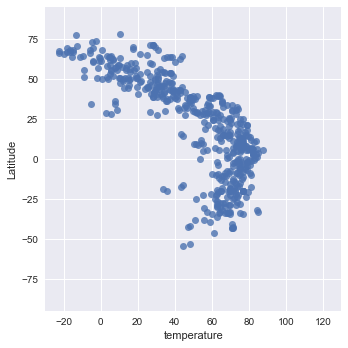
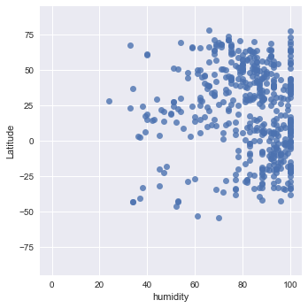
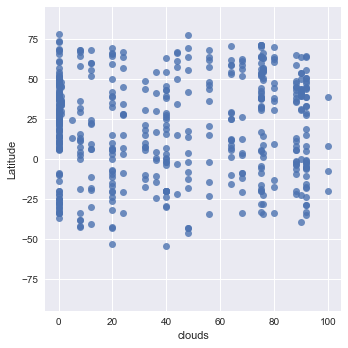
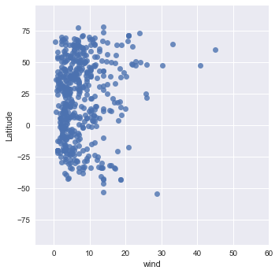

```python
import numpy as np
import pandas as pd
import matplotlib.pyplot as plt
import requests
import json
import time
import seaborn as sns
import os
from citipy import citipy
from random import uniform

```


```python
api_key = "25bc90a1196e6f153eece0bc0b0fc9eb"
#url = "http://api.openweathermap.org/data/2.5/weather?lat={lat}&lon={lon}"
url = "http://api.openweathermap.org/data/2.5/weather?"
units = "imperial"
query_url = url + "appid=" + api_key + "&units=" + units + "&q="
query_url
```


    'http://api.openweathermap.org/data/2.5/weather?appid=25bc90a1196e6f153eece0bc0b0fc9eb&units=imperial&q='


```python
#test random long lat https://gis.stackexchange.com/questions/59339/generate-random-world-point-geometries
def newpoint():
   return uniform(-180,180), uniform(-90, 90)

points = (newpoint() for x in range(10))
for point in points:
   print(point)
#passes getting coordinates
```

    (10.602072596938143, -42.80141915300513)
    (147.31721767331027, -45.33547360980032)
    (-58.9569339358263, -65.89718501290635)
    (-79.64830906012534, -58.891310854733845)
    (-159.68652714625915, 73.96293232865006)
    (88.94518293015949, -13.78943461535195)
    (91.68006107412322, -15.296495114202145)
    (-39.18661979986126, -21.498340367116228)
    (-87.83843697135693, -85.65407456259999)
    (91.57324887297011, -85.2933534375294)
    


```python
def newpoint():
   return uniform(-180,180), uniform(-90, 90)

points = (newpoint() for x in range(10))
for point in points:
    city = citipy.nearest_city(point[0],point[1])
    #non-repeat get city url
    if not city.city_name in cities:
        cities_url = query_url + city.city_name
        response = requests.get(cities_url).json()
        cities.append(city.city_name)
    
  
    index = index + 1
    if index == 10:
        break
cities
```


    ['barentsburg',
     'belushya guba',
     'ushuaia',
     'cape town',
     'arraial do cabo',
     'bredasdorp',
     'port alfred']


```python
weather_data = []
cities = []
index = 0


def newpoint():
   return uniform(-180,180), uniform(-90, 90)

points = (newpoint() for x in range(9000))
for point in points:
    city = citipy.nearest_city(point[0],point[1])
    
    #non-repeat get city url
    if not city.city_name in cities:
        cities_url = query_url + city.city_name
        response = requests.get(cities_url).json()
        
        if 'main' not in response:
            print("Error with city weather. skipping")

        else:
            cities.append(city.city_name)
            weather_data.append(response)
            #name_data = city
            temp_data = [data.get("main").get("temp") for data in weather_data]
            cloudiness_data = [data.get("clouds").get("all") for data in weather_data]
            wind_data = [data.get("wind").get("speed") for data in weather_data]
            humidity_data = [data.get("main").get("humidity") for data in weather_data]
            lat_data = [data.get("coord").get("lat") for data in weather_data]
            lon_data = [data.get("coord").get("lon") for data in weather_data]
            print(cities_url)

            cities_df = {"city": cities, "longitude": lon_data, "Latitude": lat_data, "temperature": temp_data, 
                             "humidity": humidity_data, "wind": wind_data, "clouds": cloudiness_data}
            weather_df = pd.DataFrame(cities_df)
            weather_df


            index = index + 1
            if index == 500:
                break
weather_df
```

    http://api.openweathermap.org/data/2.5/weather?appid=25bc90a1196e6f153eece0bc0b0fc9eb&units=imperial&q=los llanos de aridane
    http://api.openweathermap.org/data/2.5/weather?appid=25bc90a1196e6f153eece0bc0b0fc9eb&units=imperial&q=tessalit
    http://api.openweathermap.org/data/2.5/weather?appid=25bc90a1196e6f153eece0bc0b0fc9eb&units=imperial&q=dikson
    http://api.openweathermap.org/data/2.5/weather?appid=25bc90a1196e6f153eece0bc0b0fc9eb&units=imperial&q=cidreira
    http://api.openweathermap.org/data/2.5/weather?appid=25bc90a1196e6f153eece0bc0b0fc9eb&units=imperial&q=saint george
    http://api.openweathermap.org/data/2.5/weather?appid=25bc90a1196e6f153eece0bc0b0fc9eb&units=imperial&q=bredasdorp
    Error with city weather. skipping
    http://api.openweathermap.org/data/2.5/weather?appid=25bc90a1196e6f153eece0bc0b0fc9eb&units=imperial&q=ushuaia
    http://api.openweathermap.org/data/2.5/weather?appid=25bc90a1196e6f153eece0bc0b0fc9eb&units=imperial&q=klaksvik
    http://api.openweathermap.org/data/2.5/weather?appid=25bc90a1196e6f153eece0bc0b0fc9eb&units=imperial&q=port alfred
    http://api.openweathermap.org/data/2.5/weather?appid=25bc90a1196e6f153eece0bc0b0fc9eb&units=imperial&q=qaanaaq
    http://api.openweathermap.org/data/2.5/weather?appid=25bc90a1196e6f153eece0bc0b0fc9eb&units=imperial&q=wenchi
    http://api.openweathermap.org/data/2.5/weather?appid=25bc90a1196e6f153eece0bc0b0fc9eb&units=imperial&q=port elizabeth
    http://api.openweathermap.org/data/2.5/weather?appid=25bc90a1196e6f153eece0bc0b0fc9eb&units=imperial&q=longyearbyen
    http://api.openweathermap.org/data/2.5/weather?appid=25bc90a1196e6f153eece0bc0b0fc9eb&units=imperial&q=jijiga
    http://api.openweathermap.org/data/2.5/weather?appid=25bc90a1196e6f153eece0bc0b0fc9eb&units=imperial&q=jamestown
    Error with city weather. skipping
    http://api.openweathermap.org/data/2.5/weather?appid=25bc90a1196e6f153eece0bc0b0fc9eb&units=imperial&q=iqaluit
    http://api.openweathermap.org/data/2.5/weather?appid=25bc90a1196e6f153eece0bc0b0fc9eb&units=imperial&q=warrington
    http://api.openweathermap.org/data/2.5/weather?appid=25bc90a1196e6f153eece0bc0b0fc9eb&units=imperial&q=bonthe
    Error with city weather. skipping
    Error with city weather. skipping
    http://api.openweathermap.org/data/2.5/weather?appid=25bc90a1196e6f153eece0bc0b0fc9eb&units=imperial&q=plettenberg bay
    http://api.openweathermap.org/data/2.5/weather?appid=25bc90a1196e6f153eece0bc0b0fc9eb&units=imperial&q=victoria
    Error with city weather. skipping
    http://api.openweathermap.org/data/2.5/weather?appid=25bc90a1196e6f153eece0bc0b0fc9eb&units=imperial&q=shakawe
    http://api.openweathermap.org/data/2.5/weather?appid=25bc90a1196e6f153eece0bc0b0fc9eb&units=imperial&q=dingle
    http://api.openweathermap.org/data/2.5/weather?appid=25bc90a1196e6f153eece0bc0b0fc9eb&units=imperial&q=hermanus
    Error with city weather. skipping
    http://api.openweathermap.org/data/2.5/weather?appid=25bc90a1196e6f153eece0bc0b0fc9eb&units=imperial&q=mahebourg
    http://api.openweathermap.org/data/2.5/weather?appid=25bc90a1196e6f153eece0bc0b0fc9eb&units=imperial&q=upernavik
    http://api.openweathermap.org/data/2.5/weather?appid=25bc90a1196e6f153eece0bc0b0fc9eb&units=imperial&q=torbay
    http://api.openweathermap.org/data/2.5/weather?appid=25bc90a1196e6f153eece0bc0b0fc9eb&units=imperial&q=cape town
    http://api.openweathermap.org/data/2.5/weather?appid=25bc90a1196e6f153eece0bc0b0fc9eb&units=imperial&q=alexandria
    http://api.openweathermap.org/data/2.5/weather?appid=25bc90a1196e6f153eece0bc0b0fc9eb&units=imperial&q=mumford
    http://api.openweathermap.org/data/2.5/weather?appid=25bc90a1196e6f153eece0bc0b0fc9eb&units=imperial&q=cambui
    http://api.openweathermap.org/data/2.5/weather?appid=25bc90a1196e6f153eece0bc0b0fc9eb&units=imperial&q=berlevag
    Error with city weather. skipping
    http://api.openweathermap.org/data/2.5/weather?appid=25bc90a1196e6f153eece0bc0b0fc9eb&units=imperial&q=richards bay
    Error with city weather. skipping
    http://api.openweathermap.org/data/2.5/weather?appid=25bc90a1196e6f153eece0bc0b0fc9eb&units=imperial&q=busselton
    http://api.openweathermap.org/data/2.5/weather?appid=25bc90a1196e6f153eece0bc0b0fc9eb&units=imperial&q=ballina
    http://api.openweathermap.org/data/2.5/weather?appid=25bc90a1196e6f153eece0bc0b0fc9eb&units=imperial&q=albany
    Error with city weather. skipping
    Error with city weather. skipping
    http://api.openweathermap.org/data/2.5/weather?appid=25bc90a1196e6f153eece0bc0b0fc9eb&units=imperial&q=reconquista
    http://api.openweathermap.org/data/2.5/weather?appid=25bc90a1196e6f153eece0bc0b0fc9eb&units=imperial&q=sorland
    http://api.openweathermap.org/data/2.5/weather?appid=25bc90a1196e6f153eece0bc0b0fc9eb&units=imperial&q=kuruman
    Error with city weather. skipping
    http://api.openweathermap.org/data/2.5/weather?appid=25bc90a1196e6f153eece0bc0b0fc9eb&units=imperial&q=lovozero
    Error with city weather. skipping
    Error with city weather. skipping
    http://api.openweathermap.org/data/2.5/weather?appid=25bc90a1196e6f153eece0bc0b0fc9eb&units=imperial&q=chuy
    http://api.openweathermap.org/data/2.5/weather?appid=25bc90a1196e6f153eece0bc0b0fc9eb&units=imperial&q=shu
    http://api.openweathermap.org/data/2.5/weather?appid=25bc90a1196e6f153eece0bc0b0fc9eb&units=imperial&q=punta arenas
    http://api.openweathermap.org/data/2.5/weather?appid=25bc90a1196e6f153eece0bc0b0fc9eb&units=imperial&q=tasiilaq
    http://api.openweathermap.org/data/2.5/weather?appid=25bc90a1196e6f153eece0bc0b0fc9eb&units=imperial&q=thompson
    http://api.openweathermap.org/data/2.5/weather?appid=25bc90a1196e6f153eece0bc0b0fc9eb&units=imperial&q=tanout
    Error with city weather. skipping
    http://api.openweathermap.org/data/2.5/weather?appid=25bc90a1196e6f153eece0bc0b0fc9eb&units=imperial&q=ribeira grande
    http://api.openweathermap.org/data/2.5/weather?appid=25bc90a1196e6f153eece0bc0b0fc9eb&units=imperial&q=long beach
    http://api.openweathermap.org/data/2.5/weather?appid=25bc90a1196e6f153eece0bc0b0fc9eb&units=imperial&q=ancud
    http://api.openweathermap.org/data/2.5/weather?appid=25bc90a1196e6f153eece0bc0b0fc9eb&units=imperial&q=puerto cabezas
    http://api.openweathermap.org/data/2.5/weather?appid=25bc90a1196e6f153eece0bc0b0fc9eb&units=imperial&q=peterhead
    http://api.openweathermap.org/data/2.5/weather?appid=25bc90a1196e6f153eece0bc0b0fc9eb&units=imperial&q=ponta do sol
    http://api.openweathermap.org/data/2.5/weather?appid=25bc90a1196e6f153eece0bc0b0fc9eb&units=imperial&q=cayenne
    Error with city weather. skipping
    http://api.openweathermap.org/data/2.5/weather?appid=25bc90a1196e6f153eece0bc0b0fc9eb&units=imperial&q=matay
    http://api.openweathermap.org/data/2.5/weather?appid=25bc90a1196e6f153eece0bc0b0fc9eb&units=imperial&q=monte alegre
    http://api.openweathermap.org/data/2.5/weather?appid=25bc90a1196e6f153eece0bc0b0fc9eb&units=imperial&q=cagli
    Error with city weather. skipping
    http://api.openweathermap.org/data/2.5/weather?appid=25bc90a1196e6f153eece0bc0b0fc9eb&units=imperial&q=cap malheureux
    http://api.openweathermap.org/data/2.5/weather?appid=25bc90a1196e6f153eece0bc0b0fc9eb&units=imperial&q=kruisfontein
    http://api.openweathermap.org/data/2.5/weather?appid=25bc90a1196e6f153eece0bc0b0fc9eb&units=imperial&q=qandala
    Error with city weather. skipping
    Error with city weather. skipping
    http://api.openweathermap.org/data/2.5/weather?appid=25bc90a1196e6f153eece0bc0b0fc9eb&units=imperial&q=saint anthony
    Error with city weather. skipping
    http://api.openweathermap.org/data/2.5/weather?appid=25bc90a1196e6f153eece0bc0b0fc9eb&units=imperial&q=mapiripan
    Error with city weather. skipping
    http://api.openweathermap.org/data/2.5/weather?appid=25bc90a1196e6f153eece0bc0b0fc9eb&units=imperial&q=iralaya
    http://api.openweathermap.org/data/2.5/weather?appid=25bc90a1196e6f153eece0bc0b0fc9eb&units=imperial&q=niteroi
    http://api.openweathermap.org/data/2.5/weather?appid=25bc90a1196e6f153eece0bc0b0fc9eb&units=imperial&q=mar del plata
    Error with city weather. skipping
    http://api.openweathermap.org/data/2.5/weather?appid=25bc90a1196e6f153eece0bc0b0fc9eb&units=imperial&q=arinos
    Error with city weather. skipping
    http://api.openweathermap.org/data/2.5/weather?appid=25bc90a1196e6f153eece0bc0b0fc9eb&units=imperial&q=shemysheyka
    Error with city weather. skipping
    Error with city weather. skipping
    http://api.openweathermap.org/data/2.5/weather?appid=25bc90a1196e6f153eece0bc0b0fc9eb&units=imperial&q=taoudenni
    Error with city weather. skipping
    http://api.openweathermap.org/data/2.5/weather?appid=25bc90a1196e6f153eece0bc0b0fc9eb&units=imperial&q=luderitz
    Error with city weather. skipping
    Error with city weather. skipping
    http://api.openweathermap.org/data/2.5/weather?appid=25bc90a1196e6f153eece0bc0b0fc9eb&units=imperial&q=coruripe
    http://api.openweathermap.org/data/2.5/weather?appid=25bc90a1196e6f153eece0bc0b0fc9eb&units=imperial&q=mana
    http://api.openweathermap.org/data/2.5/weather?appid=25bc90a1196e6f153eece0bc0b0fc9eb&units=imperial&q=zvishavane
    http://api.openweathermap.org/data/2.5/weather?appid=25bc90a1196e6f153eece0bc0b0fc9eb&units=imperial&q=marystown
    Error with city weather. skipping
    Error with city weather. skipping
    http://api.openweathermap.org/data/2.5/weather?appid=25bc90a1196e6f153eece0bc0b0fc9eb&units=imperial&q=ilulissat
    Error with city weather. skipping
    Error with city weather. skipping
    http://api.openweathermap.org/data/2.5/weather?appid=25bc90a1196e6f153eece0bc0b0fc9eb&units=imperial&q=carlos chagas
    http://api.openweathermap.org/data/2.5/weather?appid=25bc90a1196e6f153eece0bc0b0fc9eb&units=imperial&q=batetskiy
    Error with city weather. skipping
    Error with city weather. skipping
    Error with city weather. skipping
    http://api.openweathermap.org/data/2.5/weather?appid=25bc90a1196e6f153eece0bc0b0fc9eb&units=imperial&q=saint-pierre
    Error with city weather. skipping
    Error with city weather. skipping
    http://api.openweathermap.org/data/2.5/weather?appid=25bc90a1196e6f153eece0bc0b0fc9eb&units=imperial&q=goure
    Error with city weather. skipping
    http://api.openweathermap.org/data/2.5/weather?appid=25bc90a1196e6f153eece0bc0b0fc9eb&units=imperial&q=mizdah
    Error with city weather. skipping
    Error with city weather. skipping
    Error with city weather. skipping
    Error with city weather. skipping
    http://api.openweathermap.org/data/2.5/weather?appid=25bc90a1196e6f153eece0bc0b0fc9eb&units=imperial&q=castelbuono
    Error with city weather. skipping
    http://api.openweathermap.org/data/2.5/weather?appid=25bc90a1196e6f153eece0bc0b0fc9eb&units=imperial&q=maraa
    Error with city weather. skipping
    http://api.openweathermap.org/data/2.5/weather?appid=25bc90a1196e6f153eece0bc0b0fc9eb&units=imperial&q=tabuk
    http://api.openweathermap.org/data/2.5/weather?appid=25bc90a1196e6f153eece0bc0b0fc9eb&units=imperial&q=ankpa
    Error with city weather. skipping
    Error with city weather. skipping
    Error with city weather. skipping
    http://api.openweathermap.org/data/2.5/weather?appid=25bc90a1196e6f153eece0bc0b0fc9eb&units=imperial&q=vila franca do campo
    http://api.openweathermap.org/data/2.5/weather?appid=25bc90a1196e6f153eece0bc0b0fc9eb&units=imperial&q=geraldton
    http://api.openweathermap.org/data/2.5/weather?appid=25bc90a1196e6f153eece0bc0b0fc9eb&units=imperial&q=road town
    http://api.openweathermap.org/data/2.5/weather?appid=25bc90a1196e6f153eece0bc0b0fc9eb&units=imperial&q=eucaliptus
    http://api.openweathermap.org/data/2.5/weather?appid=25bc90a1196e6f153eece0bc0b0fc9eb&units=imperial&q=gainesville
    Error with city weather. skipping
    http://api.openweathermap.org/data/2.5/weather?appid=25bc90a1196e6f153eece0bc0b0fc9eb&units=imperial&q=hobyo
    http://api.openweathermap.org/data/2.5/weather?appid=25bc90a1196e6f153eece0bc0b0fc9eb&units=imperial&q=saint-francois
    Error with city weather. skipping
    http://api.openweathermap.org/data/2.5/weather?appid=25bc90a1196e6f153eece0bc0b0fc9eb&units=imperial&q=omboue
    http://api.openweathermap.org/data/2.5/weather?appid=25bc90a1196e6f153eece0bc0b0fc9eb&units=imperial&q=pombia
    http://api.openweathermap.org/data/2.5/weather?appid=25bc90a1196e6f153eece0bc0b0fc9eb&units=imperial&q=east london
    http://api.openweathermap.org/data/2.5/weather?appid=25bc90a1196e6f153eece0bc0b0fc9eb&units=imperial&q=abu samrah
    http://api.openweathermap.org/data/2.5/weather?appid=25bc90a1196e6f153eece0bc0b0fc9eb&units=imperial&q=petrozavodsk
    http://api.openweathermap.org/data/2.5/weather?appid=25bc90a1196e6f153eece0bc0b0fc9eb&units=imperial&q=mporokoso
    Error with city weather. skipping
    Error with city weather. skipping
    http://api.openweathermap.org/data/2.5/weather?appid=25bc90a1196e6f153eece0bc0b0fc9eb&units=imperial&q=guarda
    Error with city weather. skipping
    Error with city weather. skipping
    Error with city weather. skipping
    Error with city weather. skipping
    Error with city weather. skipping
    Error with city weather. skipping
    Error with city weather. skipping
    Error with city weather. skipping
    Error with city weather. skipping
    http://api.openweathermap.org/data/2.5/weather?appid=25bc90a1196e6f153eece0bc0b0fc9eb&units=imperial&q=baile tusnad
    Error with city weather. skipping
    http://api.openweathermap.org/data/2.5/weather?appid=25bc90a1196e6f153eece0bc0b0fc9eb&units=imperial&q=hamilton
    http://api.openweathermap.org/data/2.5/weather?appid=25bc90a1196e6f153eece0bc0b0fc9eb&units=imperial&q=kudahuvadhoo
    http://api.openweathermap.org/data/2.5/weather?appid=25bc90a1196e6f153eece0bc0b0fc9eb&units=imperial&q=narsaq
    http://api.openweathermap.org/data/2.5/weather?appid=25bc90a1196e6f153eece0bc0b0fc9eb&units=imperial&q=santa isabel do rio negro
    http://api.openweathermap.org/data/2.5/weather?appid=25bc90a1196e6f153eece0bc0b0fc9eb&units=imperial&q=cap-aux-meules
    http://api.openweathermap.org/data/2.5/weather?appid=25bc90a1196e6f153eece0bc0b0fc9eb&units=imperial&q=araouane
    http://api.openweathermap.org/data/2.5/weather?appid=25bc90a1196e6f153eece0bc0b0fc9eb&units=imperial&q=bambous virieux
    Error with city weather. skipping
    Error with city weather. skipping
    Error with city weather. skipping
    http://api.openweathermap.org/data/2.5/weather?appid=25bc90a1196e6f153eece0bc0b0fc9eb&units=imperial&q=husavik
    http://api.openweathermap.org/data/2.5/weather?appid=25bc90a1196e6f153eece0bc0b0fc9eb&units=imperial&q=havelock
    http://api.openweathermap.org/data/2.5/weather?appid=25bc90a1196e6f153eece0bc0b0fc9eb&units=imperial&q=manakara
    Error with city weather. skipping
    Error with city weather. skipping
    http://api.openweathermap.org/data/2.5/weather?appid=25bc90a1196e6f153eece0bc0b0fc9eb&units=imperial&q=faya
    http://api.openweathermap.org/data/2.5/weather?appid=25bc90a1196e6f153eece0bc0b0fc9eb&units=imperial&q=usilampatti
    http://api.openweathermap.org/data/2.5/weather?appid=25bc90a1196e6f153eece0bc0b0fc9eb&units=imperial&q=bonfim
    Error with city weather. skipping
    http://api.openweathermap.org/data/2.5/weather?appid=25bc90a1196e6f153eece0bc0b0fc9eb&units=imperial&q=challapata
    Error with city weather. skipping
    http://api.openweathermap.org/data/2.5/weather?appid=25bc90a1196e6f153eece0bc0b0fc9eb&units=imperial&q=luanda
    http://api.openweathermap.org/data/2.5/weather?appid=25bc90a1196e6f153eece0bc0b0fc9eb&units=imperial&q=aswan
    http://api.openweathermap.org/data/2.5/weather?appid=25bc90a1196e6f153eece0bc0b0fc9eb&units=imperial&q=tamasane
    Error with city weather. skipping
    http://api.openweathermap.org/data/2.5/weather?appid=25bc90a1196e6f153eece0bc0b0fc9eb&units=imperial&q=touros
    http://api.openweathermap.org/data/2.5/weather?appid=25bc90a1196e6f153eece0bc0b0fc9eb&units=imperial&q=bihariganj
    http://api.openweathermap.org/data/2.5/weather?appid=25bc90a1196e6f153eece0bc0b0fc9eb&units=imperial&q=nanortalik
    http://api.openweathermap.org/data/2.5/weather?appid=25bc90a1196e6f153eece0bc0b0fc9eb&units=imperial&q=abong mbang
    Error with city weather. skipping
    http://api.openweathermap.org/data/2.5/weather?appid=25bc90a1196e6f153eece0bc0b0fc9eb&units=imperial&q=castro
    http://api.openweathermap.org/data/2.5/weather?appid=25bc90a1196e6f153eece0bc0b0fc9eb&units=imperial&q=kidal
    http://api.openweathermap.org/data/2.5/weather?appid=25bc90a1196e6f153eece0bc0b0fc9eb&units=imperial&q=chittur
    Error with city weather. skipping
    Error with city weather. skipping
    Error with city weather. skipping
    Error with city weather. skipping
    http://api.openweathermap.org/data/2.5/weather?appid=25bc90a1196e6f153eece0bc0b0fc9eb&units=imperial&q=humaita
    http://api.openweathermap.org/data/2.5/weather?appid=25bc90a1196e6f153eece0bc0b0fc9eb&units=imperial&q=uarini
    http://api.openweathermap.org/data/2.5/weather?appid=25bc90a1196e6f153eece0bc0b0fc9eb&units=imperial&q=arraial do cabo
    http://api.openweathermap.org/data/2.5/weather?appid=25bc90a1196e6f153eece0bc0b0fc9eb&units=imperial&q=shubarshi
    Error with city weather. skipping
    http://api.openweathermap.org/data/2.5/weather?appid=25bc90a1196e6f153eece0bc0b0fc9eb&units=imperial&q=bathsheba
    http://api.openweathermap.org/data/2.5/weather?appid=25bc90a1196e6f153eece0bc0b0fc9eb&units=imperial&q=lebu
    http://api.openweathermap.org/data/2.5/weather?appid=25bc90a1196e6f153eece0bc0b0fc9eb&units=imperial&q=beeskow
    http://api.openweathermap.org/data/2.5/weather?appid=25bc90a1196e6f153eece0bc0b0fc9eb&units=imperial&q=batticaloa
    http://api.openweathermap.org/data/2.5/weather?appid=25bc90a1196e6f153eece0bc0b0fc9eb&units=imperial&q=grand gaube
    Error with city weather. skipping
    http://api.openweathermap.org/data/2.5/weather?appid=25bc90a1196e6f153eece0bc0b0fc9eb&units=imperial&q=rorvik
    Error with city weather. skipping
    http://api.openweathermap.org/data/2.5/weather?appid=25bc90a1196e6f153eece0bc0b0fc9eb&units=imperial&q=peniche
    Error with city weather. skipping
    http://api.openweathermap.org/data/2.5/weather?appid=25bc90a1196e6f153eece0bc0b0fc9eb&units=imperial&q=girard
    http://api.openweathermap.org/data/2.5/weather?appid=25bc90a1196e6f153eece0bc0b0fc9eb&units=imperial&q=kindu
    http://api.openweathermap.org/data/2.5/weather?appid=25bc90a1196e6f153eece0bc0b0fc9eb&units=imperial&q=clyde river
    http://api.openweathermap.org/data/2.5/weather?appid=25bc90a1196e6f153eece0bc0b0fc9eb&units=imperial&q=coquimbo
    Error with city weather. skipping
    Error with city weather. skipping
    Error with city weather. skipping
    http://api.openweathermap.org/data/2.5/weather?appid=25bc90a1196e6f153eece0bc0b0fc9eb&units=imperial&q=georgetown
    http://api.openweathermap.org/data/2.5/weather?appid=25bc90a1196e6f153eece0bc0b0fc9eb&units=imperial&q=portobelo
    http://api.openweathermap.org/data/2.5/weather?appid=25bc90a1196e6f153eece0bc0b0fc9eb&units=imperial&q=ornskoldsvik
    Error with city weather. skipping
    http://api.openweathermap.org/data/2.5/weather?appid=25bc90a1196e6f153eece0bc0b0fc9eb&units=imperial&q=mozarlandia
    Error with city weather. skipping
    Error with city weather. skipping
    http://api.openweathermap.org/data/2.5/weather?appid=25bc90a1196e6f153eece0bc0b0fc9eb&units=imperial&q=yar-sale
    http://api.openweathermap.org/data/2.5/weather?appid=25bc90a1196e6f153eece0bc0b0fc9eb&units=imperial&q=kulhudhuffushi
    http://api.openweathermap.org/data/2.5/weather?appid=25bc90a1196e6f153eece0bc0b0fc9eb&units=imperial&q=sayyan
    Error with city weather. skipping
    http://api.openweathermap.org/data/2.5/weather?appid=25bc90a1196e6f153eece0bc0b0fc9eb&units=imperial&q=calama
    Error with city weather. skipping
    http://api.openweathermap.org/data/2.5/weather?appid=25bc90a1196e6f153eece0bc0b0fc9eb&units=imperial&q=piombino
    Error with city weather. skipping
    http://api.openweathermap.org/data/2.5/weather?appid=25bc90a1196e6f153eece0bc0b0fc9eb&units=imperial&q=colares
    http://api.openweathermap.org/data/2.5/weather?appid=25bc90a1196e6f153eece0bc0b0fc9eb&units=imperial&q=vila velha
    Error with city weather. skipping
    http://api.openweathermap.org/data/2.5/weather?appid=25bc90a1196e6f153eece0bc0b0fc9eb&units=imperial&q=port-cartier
    Error with city weather. skipping
    http://api.openweathermap.org/data/2.5/weather?appid=25bc90a1196e6f153eece0bc0b0fc9eb&units=imperial&q=oranjemund
    http://api.openweathermap.org/data/2.5/weather?appid=25bc90a1196e6f153eece0bc0b0fc9eb&units=imperial&q=teguise
    Error with city weather. skipping
    http://api.openweathermap.org/data/2.5/weather?appid=25bc90a1196e6f153eece0bc0b0fc9eb&units=imperial&q=brae
    http://api.openweathermap.org/data/2.5/weather?appid=25bc90a1196e6f153eece0bc0b0fc9eb&units=imperial&q=vilhena
    Error with city weather. skipping
    http://api.openweathermap.org/data/2.5/weather?appid=25bc90a1196e6f153eece0bc0b0fc9eb&units=imperial&q=saint-philippe
    http://api.openweathermap.org/data/2.5/weather?appid=25bc90a1196e6f153eece0bc0b0fc9eb&units=imperial&q=skibbereen
    http://api.openweathermap.org/data/2.5/weather?appid=25bc90a1196e6f153eece0bc0b0fc9eb&units=imperial&q=methala
    http://api.openweathermap.org/data/2.5/weather?appid=25bc90a1196e6f153eece0bc0b0fc9eb&units=imperial&q=vardo
    http://api.openweathermap.org/data/2.5/weather?appid=25bc90a1196e6f153eece0bc0b0fc9eb&units=imperial&q=goderich
    http://api.openweathermap.org/data/2.5/weather?appid=25bc90a1196e6f153eece0bc0b0fc9eb&units=imperial&q=moose factory
    Error with city weather. skipping
    http://api.openweathermap.org/data/2.5/weather?appid=25bc90a1196e6f153eece0bc0b0fc9eb&units=imperial&q=beckley
    Error with city weather. skipping
    http://api.openweathermap.org/data/2.5/weather?appid=25bc90a1196e6f153eece0bc0b0fc9eb&units=imperial&q=saint-georges
    http://api.openweathermap.org/data/2.5/weather?appid=25bc90a1196e6f153eece0bc0b0fc9eb&units=imperial&q=hithadhoo
    Error with city weather. skipping
    Error with city weather. skipping
    http://api.openweathermap.org/data/2.5/weather?appid=25bc90a1196e6f153eece0bc0b0fc9eb&units=imperial&q=kanniyakumari
    Error with city weather. skipping
    http://api.openweathermap.org/data/2.5/weather?appid=25bc90a1196e6f153eece0bc0b0fc9eb&units=imperial&q=souillac
    Error with city weather. skipping
    http://api.openweathermap.org/data/2.5/weather?appid=25bc90a1196e6f153eece0bc0b0fc9eb&units=imperial&q=esfarayen
    http://api.openweathermap.org/data/2.5/weather?appid=25bc90a1196e6f153eece0bc0b0fc9eb&units=imperial&q=labranzagrande
    Error with city weather. skipping
    Error with city weather. skipping
    Error with city weather. skipping
    Error with city weather. skipping
    http://api.openweathermap.org/data/2.5/weather?appid=25bc90a1196e6f153eece0bc0b0fc9eb&units=imperial&q=isla mujeres
    Error with city weather. skipping
    Error with city weather. skipping
    http://api.openweathermap.org/data/2.5/weather?appid=25bc90a1196e6f153eece0bc0b0fc9eb&units=imperial&q=mandera
    Error with city weather. skipping
    http://api.openweathermap.org/data/2.5/weather?appid=25bc90a1196e6f153eece0bc0b0fc9eb&units=imperial&q=banda aceh
    http://api.openweathermap.org/data/2.5/weather?appid=25bc90a1196e6f153eece0bc0b0fc9eb&units=imperial&q=huarmey
    Error with city weather. skipping
    http://api.openweathermap.org/data/2.5/weather?appid=25bc90a1196e6f153eece0bc0b0fc9eb&units=imperial&q=gamba
    http://api.openweathermap.org/data/2.5/weather?appid=25bc90a1196e6f153eece0bc0b0fc9eb&units=imperial&q=acurenam
    http://api.openweathermap.org/data/2.5/weather?appid=25bc90a1196e6f153eece0bc0b0fc9eb&units=imperial&q=turukhansk
    http://api.openweathermap.org/data/2.5/weather?appid=25bc90a1196e6f153eece0bc0b0fc9eb&units=imperial&q=caravelas
    Error with city weather. skipping
    http://api.openweathermap.org/data/2.5/weather?appid=25bc90a1196e6f153eece0bc0b0fc9eb&units=imperial&q=hargeysa
    http://api.openweathermap.org/data/2.5/weather?appid=25bc90a1196e6f153eece0bc0b0fc9eb&units=imperial&q=dovbysh
    http://api.openweathermap.org/data/2.5/weather?appid=25bc90a1196e6f153eece0bc0b0fc9eb&units=imperial&q=codrington
    http://api.openweathermap.org/data/2.5/weather?appid=25bc90a1196e6f153eece0bc0b0fc9eb&units=imperial&q=tocopilla
    http://api.openweathermap.org/data/2.5/weather?appid=25bc90a1196e6f153eece0bc0b0fc9eb&units=imperial&q=tromso
    http://api.openweathermap.org/data/2.5/weather?appid=25bc90a1196e6f153eece0bc0b0fc9eb&units=imperial&q=matadi
    http://api.openweathermap.org/data/2.5/weather?appid=25bc90a1196e6f153eece0bc0b0fc9eb&units=imperial&q=ostrovnoy
    http://api.openweathermap.org/data/2.5/weather?appid=25bc90a1196e6f153eece0bc0b0fc9eb&units=imperial&q=povenets
    http://api.openweathermap.org/data/2.5/weather?appid=25bc90a1196e6f153eece0bc0b0fc9eb&units=imperial&q=gazalkent
    http://api.openweathermap.org/data/2.5/weather?appid=25bc90a1196e6f153eece0bc0b0fc9eb&units=imperial&q=brewster
    Error with city weather. skipping
    Error with city weather. skipping
    http://api.openweathermap.org/data/2.5/weather?appid=25bc90a1196e6f153eece0bc0b0fc9eb&units=imperial&q=gasa
    Error with city weather. skipping
    Error with city weather. skipping
    Error with city weather. skipping
    Error with city weather. skipping
    http://api.openweathermap.org/data/2.5/weather?appid=25bc90a1196e6f153eece0bc0b0fc9eb&units=imperial&q=akhalgori
    http://api.openweathermap.org/data/2.5/weather?appid=25bc90a1196e6f153eece0bc0b0fc9eb&units=imperial&q=chapais
    Error with city weather. skipping
    Error with city weather. skipping
    http://api.openweathermap.org/data/2.5/weather?appid=25bc90a1196e6f153eece0bc0b0fc9eb&units=imperial&q=naranjito
    Error with city weather. skipping
    Error with city weather. skipping
    http://api.openweathermap.org/data/2.5/weather?appid=25bc90a1196e6f153eece0bc0b0fc9eb&units=imperial&q=gazojak
    http://api.openweathermap.org/data/2.5/weather?appid=25bc90a1196e6f153eece0bc0b0fc9eb&units=imperial&q=krotoszyn
    http://api.openweathermap.org/data/2.5/weather?appid=25bc90a1196e6f153eece0bc0b0fc9eb&units=imperial&q=barranca
    Error with city weather. skipping
    http://api.openweathermap.org/data/2.5/weather?appid=25bc90a1196e6f153eece0bc0b0fc9eb&units=imperial&q=chicama
    Error with city weather. skipping
    Error with city weather. skipping
    http://api.openweathermap.org/data/2.5/weather?appid=25bc90a1196e6f153eece0bc0b0fc9eb&units=imperial&q=saryozek
    Error with city weather. skipping
    http://api.openweathermap.org/data/2.5/weather?appid=25bc90a1196e6f153eece0bc0b0fc9eb&units=imperial&q=lodhikheda
    http://api.openweathermap.org/data/2.5/weather?appid=25bc90a1196e6f153eece0bc0b0fc9eb&units=imperial&q=namibe
    Error with city weather. skipping
    http://api.openweathermap.org/data/2.5/weather?appid=25bc90a1196e6f153eece0bc0b0fc9eb&units=imperial&q=sao filipe
    http://api.openweathermap.org/data/2.5/weather?appid=25bc90a1196e6f153eece0bc0b0fc9eb&units=imperial&q=tiznit
    http://api.openweathermap.org/data/2.5/weather?appid=25bc90a1196e6f153eece0bc0b0fc9eb&units=imperial&q=dalvik
    Error with city weather. skipping
    http://api.openweathermap.org/data/2.5/weather?appid=25bc90a1196e6f153eece0bc0b0fc9eb&units=imperial&q=nsanje
    http://api.openweathermap.org/data/2.5/weather?appid=25bc90a1196e6f153eece0bc0b0fc9eb&units=imperial&q=quatre cocos
    Error with city weather. skipping
    http://api.openweathermap.org/data/2.5/weather?appid=25bc90a1196e6f153eece0bc0b0fc9eb&units=imperial&q=kallithea
    http://api.openweathermap.org/data/2.5/weather?appid=25bc90a1196e6f153eece0bc0b0fc9eb&units=imperial&q=san andres
    http://api.openweathermap.org/data/2.5/weather?appid=25bc90a1196e6f153eece0bc0b0fc9eb&units=imperial&q=ugoofaaru
    http://api.openweathermap.org/data/2.5/weather?appid=25bc90a1196e6f153eece0bc0b0fc9eb&units=imperial&q=leh
    http://api.openweathermap.org/data/2.5/weather?appid=25bc90a1196e6f153eece0bc0b0fc9eb&units=imperial&q=jumla
    Error with city weather. skipping
    Error with city weather. skipping
    Error with city weather. skipping
    http://api.openweathermap.org/data/2.5/weather?appid=25bc90a1196e6f153eece0bc0b0fc9eb&units=imperial&q=doka
    Error with city weather. skipping
    http://api.openweathermap.org/data/2.5/weather?appid=25bc90a1196e6f153eece0bc0b0fc9eb&units=imperial&q=san cristobal
    http://api.openweathermap.org/data/2.5/weather?appid=25bc90a1196e6f153eece0bc0b0fc9eb&units=imperial&q=la macarena
    http://api.openweathermap.org/data/2.5/weather?appid=25bc90a1196e6f153eece0bc0b0fc9eb&units=imperial&q=birmingham
    Error with city weather. skipping
    Error with city weather. skipping
    Error with city weather. skipping
    Error with city weather. skipping
    Error with city weather. skipping
    Error with city weather. skipping
    http://api.openweathermap.org/data/2.5/weather?appid=25bc90a1196e6f153eece0bc0b0fc9eb&units=imperial&q=dogondoutchi
    http://api.openweathermap.org/data/2.5/weather?appid=25bc90a1196e6f153eece0bc0b0fc9eb&units=imperial&q=opuwo
    http://api.openweathermap.org/data/2.5/weather?appid=25bc90a1196e6f153eece0bc0b0fc9eb&units=imperial&q=amapa
    Error with city weather. skipping
    Error with city weather. skipping
    Error with city weather. skipping
    Error with city weather. skipping
    Error with city weather. skipping
    http://api.openweathermap.org/data/2.5/weather?appid=25bc90a1196e6f153eece0bc0b0fc9eb&units=imperial&q=abu dhabi
    http://api.openweathermap.org/data/2.5/weather?appid=25bc90a1196e6f153eece0bc0b0fc9eb&units=imperial&q=itarema
    Error with city weather. skipping
    http://api.openweathermap.org/data/2.5/weather?appid=25bc90a1196e6f153eece0bc0b0fc9eb&units=imperial&q=timra
    http://api.openweathermap.org/data/2.5/weather?appid=25bc90a1196e6f153eece0bc0b0fc9eb&units=imperial&q=taltal
    http://api.openweathermap.org/data/2.5/weather?appid=25bc90a1196e6f153eece0bc0b0fc9eb&units=imperial&q=lysyye gory
    http://api.openweathermap.org/data/2.5/weather?appid=25bc90a1196e6f153eece0bc0b0fc9eb&units=imperial&q=selma
    http://api.openweathermap.org/data/2.5/weather?appid=25bc90a1196e6f153eece0bc0b0fc9eb&units=imperial&q=salinas
    http://api.openweathermap.org/data/2.5/weather?appid=25bc90a1196e6f153eece0bc0b0fc9eb&units=imperial&q=bondo
    http://api.openweathermap.org/data/2.5/weather?appid=25bc90a1196e6f153eece0bc0b0fc9eb&units=imperial&q=bonavista
    Error with city weather. skipping
    Error with city weather. skipping
    Error with city weather. skipping
    http://api.openweathermap.org/data/2.5/weather?appid=25bc90a1196e6f153eece0bc0b0fc9eb&units=imperial&q=koutsouras
    http://api.openweathermap.org/data/2.5/weather?appid=25bc90a1196e6f153eece0bc0b0fc9eb&units=imperial&q=uige
    Error with city weather. skipping
    http://api.openweathermap.org/data/2.5/weather?appid=25bc90a1196e6f153eece0bc0b0fc9eb&units=imperial&q=mazagao
    http://api.openweathermap.org/data/2.5/weather?appid=25bc90a1196e6f153eece0bc0b0fc9eb&units=imperial&q=dera bugti
    Error with city weather. skipping
    http://api.openweathermap.org/data/2.5/weather?appid=25bc90a1196e6f153eece0bc0b0fc9eb&units=imperial&q=melbu
    Error with city weather. skipping
    http://api.openweathermap.org/data/2.5/weather?appid=25bc90a1196e6f153eece0bc0b0fc9eb&units=imperial&q=sao gabriel da cachoeira
    http://api.openweathermap.org/data/2.5/weather?appid=25bc90a1196e6f153eece0bc0b0fc9eb&units=imperial&q=salalah
    http://api.openweathermap.org/data/2.5/weather?appid=25bc90a1196e6f153eece0bc0b0fc9eb&units=imperial&q=burdur
    Error with city weather. skipping
    Error with city weather. skipping
    http://api.openweathermap.org/data/2.5/weather?appid=25bc90a1196e6f153eece0bc0b0fc9eb&units=imperial&q=lagoa
    http://api.openweathermap.org/data/2.5/weather?appid=25bc90a1196e6f153eece0bc0b0fc9eb&units=imperial&q=silifke
    Error with city weather. skipping
    Error with city weather. skipping
    http://api.openweathermap.org/data/2.5/weather?appid=25bc90a1196e6f153eece0bc0b0fc9eb&units=imperial&q=marataizes
    Error with city weather. skipping
    Error with city weather. skipping
    Error with city weather. skipping
    Error with city weather. skipping
    http://api.openweathermap.org/data/2.5/weather?appid=25bc90a1196e6f153eece0bc0b0fc9eb&units=imperial&q=chitipa
    Error with city weather. skipping
    Error with city weather. skipping
    http://api.openweathermap.org/data/2.5/weather?appid=25bc90a1196e6f153eece0bc0b0fc9eb&units=imperial&q=novy bor
    Error with city weather. skipping
    Error with city weather. skipping
    Error with city weather. skipping
    Error with city weather. skipping
    Error with city weather. skipping
    http://api.openweathermap.org/data/2.5/weather?appid=25bc90a1196e6f153eece0bc0b0fc9eb&units=imperial&q=gat
    Error with city weather. skipping
    Error with city weather. skipping
    Error with city weather. skipping
    http://api.openweathermap.org/data/2.5/weather?appid=25bc90a1196e6f153eece0bc0b0fc9eb&units=imperial&q=pathalgaon
    http://api.openweathermap.org/data/2.5/weather?appid=25bc90a1196e6f153eece0bc0b0fc9eb&units=imperial&q=olomouc
    Error with city weather. skipping
    Error with city weather. skipping
    http://api.openweathermap.org/data/2.5/weather?appid=25bc90a1196e6f153eece0bc0b0fc9eb&units=imperial&q=belmonte
    http://api.openweathermap.org/data/2.5/weather?appid=25bc90a1196e6f153eece0bc0b0fc9eb&units=imperial&q=rajmahal
    Error with city weather. skipping
    http://api.openweathermap.org/data/2.5/weather?appid=25bc90a1196e6f153eece0bc0b0fc9eb&units=imperial&q=nushki
    http://api.openweathermap.org/data/2.5/weather?appid=25bc90a1196e6f153eece0bc0b0fc9eb&units=imperial&q=jutai
    Error with city weather. skipping
    http://api.openweathermap.org/data/2.5/weather?appid=25bc90a1196e6f153eece0bc0b0fc9eb&units=imperial&q=veraval
    http://api.openweathermap.org/data/2.5/weather?appid=25bc90a1196e6f153eece0bc0b0fc9eb&units=imperial&q=onguday
    Error with city weather. skipping
    Error with city weather. skipping
    http://api.openweathermap.org/data/2.5/weather?appid=25bc90a1196e6f153eece0bc0b0fc9eb&units=imperial&q=sokolo
    Error with city weather. skipping
    Error with city weather. skipping
    Error with city weather. skipping
    http://api.openweathermap.org/data/2.5/weather?appid=25bc90a1196e6f153eece0bc0b0fc9eb&units=imperial&q=siilinjarvi
    http://api.openweathermap.org/data/2.5/weather?appid=25bc90a1196e6f153eece0bc0b0fc9eb&units=imperial&q=palotina
    Error with city weather. skipping
    http://api.openweathermap.org/data/2.5/weather?appid=25bc90a1196e6f153eece0bc0b0fc9eb&units=imperial&q=astana
    http://api.openweathermap.org/data/2.5/weather?appid=25bc90a1196e6f153eece0bc0b0fc9eb&units=imperial&q=cabedelo
    http://api.openweathermap.org/data/2.5/weather?appid=25bc90a1196e6f153eece0bc0b0fc9eb&units=imperial&q=mehamn
    Error with city weather. skipping
    Error with city weather. skipping
    http://api.openweathermap.org/data/2.5/weather?appid=25bc90a1196e6f153eece0bc0b0fc9eb&units=imperial&q=constitucion
    http://api.openweathermap.org/data/2.5/weather?appid=25bc90a1196e6f153eece0bc0b0fc9eb&units=imperial&q=teguldet
    http://api.openweathermap.org/data/2.5/weather?appid=25bc90a1196e6f153eece0bc0b0fc9eb&units=imperial&q=labytnangi
    Error with city weather. skipping
    Error with city weather. skipping
    Error with city weather. skipping
    http://api.openweathermap.org/data/2.5/weather?appid=25bc90a1196e6f153eece0bc0b0fc9eb&units=imperial&q=kulebaki
    http://api.openweathermap.org/data/2.5/weather?appid=25bc90a1196e6f153eece0bc0b0fc9eb&units=imperial&q=brigantine
    Error with city weather. skipping
    http://api.openweathermap.org/data/2.5/weather?appid=25bc90a1196e6f153eece0bc0b0fc9eb&units=imperial&q=resistencia
    Error with city weather. skipping
    http://api.openweathermap.org/data/2.5/weather?appid=25bc90a1196e6f153eece0bc0b0fc9eb&units=imperial&q=mount pleasant
    http://api.openweathermap.org/data/2.5/weather?appid=25bc90a1196e6f153eece0bc0b0fc9eb&units=imperial&q=grindavik
    Error with city weather. skipping
    http://api.openweathermap.org/data/2.5/weather?appid=25bc90a1196e6f153eece0bc0b0fc9eb&units=imperial&q=halifax
    http://api.openweathermap.org/data/2.5/weather?appid=25bc90a1196e6f153eece0bc0b0fc9eb&units=imperial&q=hualmay
    Error with city weather. skipping
    Error with city weather. skipping
    http://api.openweathermap.org/data/2.5/weather?appid=25bc90a1196e6f153eece0bc0b0fc9eb&units=imperial&q=skjervoy
    Error with city weather. skipping
    Error with city weather. skipping
    Error with city weather. skipping
    http://api.openweathermap.org/data/2.5/weather?appid=25bc90a1196e6f153eece0bc0b0fc9eb&units=imperial&q=chitral
    Error with city weather. skipping
    Error with city weather. skipping
    Error with city weather. skipping
    Error with city weather. skipping
    Error with city weather. skipping
    http://api.openweathermap.org/data/2.5/weather?appid=25bc90a1196e6f153eece0bc0b0fc9eb&units=imperial&q=pisco
    Error with city weather. skipping
    Error with city weather. skipping
    Error with city weather. skipping
    http://api.openweathermap.org/data/2.5/weather?appid=25bc90a1196e6f153eece0bc0b0fc9eb&units=imperial&q=imbituba
    http://api.openweathermap.org/data/2.5/weather?appid=25bc90a1196e6f153eece0bc0b0fc9eb&units=imperial&q=nuuk
    http://api.openweathermap.org/data/2.5/weather?appid=25bc90a1196e6f153eece0bc0b0fc9eb&units=imperial&q=scarborough
    http://api.openweathermap.org/data/2.5/weather?appid=25bc90a1196e6f153eece0bc0b0fc9eb&units=imperial&q=alta floresta
    Error with city weather. skipping
    http://api.openweathermap.org/data/2.5/weather?appid=25bc90a1196e6f153eece0bc0b0fc9eb&units=imperial&q=shelbyville
    http://api.openweathermap.org/data/2.5/weather?appid=25bc90a1196e6f153eece0bc0b0fc9eb&units=imperial&q=holme
    http://api.openweathermap.org/data/2.5/weather?appid=25bc90a1196e6f153eece0bc0b0fc9eb&units=imperial&q=aden
    http://api.openweathermap.org/data/2.5/weather?appid=25bc90a1196e6f153eece0bc0b0fc9eb&units=imperial&q=talcahuano
    http://api.openweathermap.org/data/2.5/weather?appid=25bc90a1196e6f153eece0bc0b0fc9eb&units=imperial&q=qaqortoq
    http://api.openweathermap.org/data/2.5/weather?appid=25bc90a1196e6f153eece0bc0b0fc9eb&units=imperial&q=maloy
    Error with city weather. skipping
    Error with city weather. skipping
    Error with city weather. skipping
    http://api.openweathermap.org/data/2.5/weather?appid=25bc90a1196e6f153eece0bc0b0fc9eb&units=imperial&q=gien
    http://api.openweathermap.org/data/2.5/weather?appid=25bc90a1196e6f153eece0bc0b0fc9eb&units=imperial&q=grand baie
    http://api.openweathermap.org/data/2.5/weather?appid=25bc90a1196e6f153eece0bc0b0fc9eb&units=imperial&q=maceio
    http://api.openweathermap.org/data/2.5/weather?appid=25bc90a1196e6f153eece0bc0b0fc9eb&units=imperial&q=togur
    Error with city weather. skipping
    Error with city weather. skipping
    Error with city weather. skipping
    Error with city weather. skipping
    http://api.openweathermap.org/data/2.5/weather?appid=25bc90a1196e6f153eece0bc0b0fc9eb&units=imperial&q=serenje
    Error with city weather. skipping
    Error with city weather. skipping
    Error with city weather. skipping
    Error with city weather. skipping
    http://api.openweathermap.org/data/2.5/weather?appid=25bc90a1196e6f153eece0bc0b0fc9eb&units=imperial&q=mahibadhoo
    http://api.openweathermap.org/data/2.5/weather?appid=25bc90a1196e6f153eece0bc0b0fc9eb&units=imperial&q=tekeli
    Error with city weather. skipping
    http://api.openweathermap.org/data/2.5/weather?appid=25bc90a1196e6f153eece0bc0b0fc9eb&units=imperial&q=banepa
    Error with city weather. skipping
    Error with city weather. skipping
    Error with city weather. skipping
    Error with city weather. skipping
    http://api.openweathermap.org/data/2.5/weather?appid=25bc90a1196e6f153eece0bc0b0fc9eb&units=imperial&q=jacmel
    http://api.openweathermap.org/data/2.5/weather?appid=25bc90a1196e6f153eece0bc0b0fc9eb&units=imperial&q=antofagasta
    http://api.openweathermap.org/data/2.5/weather?appid=25bc90a1196e6f153eece0bc0b0fc9eb&units=imperial&q=kurchum
    Error with city weather. skipping
    Error with city weather. skipping
    Error with city weather. skipping
    Error with city weather. skipping
    Error with city weather. skipping
    Error with city weather. skipping
    Error with city weather. skipping
    http://api.openweathermap.org/data/2.5/weather?appid=25bc90a1196e6f153eece0bc0b0fc9eb&units=imperial&q=el porvenir
    http://api.openweathermap.org/data/2.5/weather?appid=25bc90a1196e6f153eece0bc0b0fc9eb&units=imperial&q=asheboro
    http://api.openweathermap.org/data/2.5/weather?appid=25bc90a1196e6f153eece0bc0b0fc9eb&units=imperial&q=kosh-agach
    http://api.openweathermap.org/data/2.5/weather?appid=25bc90a1196e6f153eece0bc0b0fc9eb&units=imperial&q=puerto maldonado
    http://api.openweathermap.org/data/2.5/weather?appid=25bc90a1196e6f153eece0bc0b0fc9eb&units=imperial&q=swinoujscie
    http://api.openweathermap.org/data/2.5/weather?appid=25bc90a1196e6f153eece0bc0b0fc9eb&units=imperial&q=lethem
    http://api.openweathermap.org/data/2.5/weather?appid=25bc90a1196e6f153eece0bc0b0fc9eb&units=imperial&q=bukama
    Error with city weather. skipping
    http://api.openweathermap.org/data/2.5/weather?appid=25bc90a1196e6f153eece0bc0b0fc9eb&units=imperial&q=sisimiut
    Error with city weather. skipping
    Error with city weather. skipping
    Error with city weather. skipping
    Error with city weather. skipping
    http://api.openweathermap.org/data/2.5/weather?appid=25bc90a1196e6f153eece0bc0b0fc9eb&units=imperial&q=kommunisticheskiy
    http://api.openweathermap.org/data/2.5/weather?appid=25bc90a1196e6f153eece0bc0b0fc9eb&units=imperial&q=back mountain
    Error with city weather. skipping
    http://api.openweathermap.org/data/2.5/weather?appid=25bc90a1196e6f153eece0bc0b0fc9eb&units=imperial&q=saldanha
    Error with city weather. skipping
    Error with city weather. skipping
    Error with city weather. skipping
    Error with city weather. skipping
    http://api.openweathermap.org/data/2.5/weather?appid=25bc90a1196e6f153eece0bc0b0fc9eb&units=imperial&q=tahoua
    Error with city weather. skipping
    Error with city weather. skipping
    Error with city weather. skipping
    http://api.openweathermap.org/data/2.5/weather?appid=25bc90a1196e6f153eece0bc0b0fc9eb&units=imperial&q=praia da vitoria
    Error with city weather. skipping
    http://api.openweathermap.org/data/2.5/weather?appid=25bc90a1196e6f153eece0bc0b0fc9eb&units=imperial&q=sovetskiy
    http://api.openweathermap.org/data/2.5/weather?appid=25bc90a1196e6f153eece0bc0b0fc9eb&units=imperial&q=iquique
    Error with city weather. skipping
    http://api.openweathermap.org/data/2.5/weather?appid=25bc90a1196e6f153eece0bc0b0fc9eb&units=imperial&q=funadhoo
    http://api.openweathermap.org/data/2.5/weather?appid=25bc90a1196e6f153eece0bc0b0fc9eb&units=imperial&q=panjab
    http://api.openweathermap.org/data/2.5/weather?appid=25bc90a1196e6f153eece0bc0b0fc9eb&units=imperial&q=viedma
    Error with city weather. skipping
    http://api.openweathermap.org/data/2.5/weather?appid=25bc90a1196e6f153eece0bc0b0fc9eb&units=imperial&q=san pedro del parana
    http://api.openweathermap.org/data/2.5/weather?appid=25bc90a1196e6f153eece0bc0b0fc9eb&units=imperial&q=dalbandin
    http://api.openweathermap.org/data/2.5/weather?appid=25bc90a1196e6f153eece0bc0b0fc9eb&units=imperial&q=havre-saint-pierre
    Error with city weather. skipping
    http://api.openweathermap.org/data/2.5/weather?appid=25bc90a1196e6f153eece0bc0b0fc9eb&units=imperial&q=chimoio
    Error with city weather. skipping
    http://api.openweathermap.org/data/2.5/weather?appid=25bc90a1196e6f153eece0bc0b0fc9eb&units=imperial&q=saint-augustin
    Error with city weather. skipping
    Error with city weather. skipping
    Error with city weather. skipping
    Error with city weather. skipping
    http://api.openweathermap.org/data/2.5/weather?appid=25bc90a1196e6f153eece0bc0b0fc9eb&units=imperial&q=port-gentil
    Error with city weather. skipping
    Error with city weather. skipping
    Error with city weather. skipping
    http://api.openweathermap.org/data/2.5/weather?appid=25bc90a1196e6f153eece0bc0b0fc9eb&units=imperial&q=vestmannaeyjar
    Error with city weather. skipping
    Error with city weather. skipping
    http://api.openweathermap.org/data/2.5/weather?appid=25bc90a1196e6f153eece0bc0b0fc9eb&units=imperial&q=najran
    Error with city weather. skipping
    http://api.openweathermap.org/data/2.5/weather?appid=25bc90a1196e6f153eece0bc0b0fc9eb&units=imperial&q=kavaratti
    http://api.openweathermap.org/data/2.5/weather?appid=25bc90a1196e6f153eece0bc0b0fc9eb&units=imperial&q=hambantota
    http://api.openweathermap.org/data/2.5/weather?appid=25bc90a1196e6f153eece0bc0b0fc9eb&units=imperial&q=barcelos
    Error with city weather. skipping
    Error with city weather. skipping
    http://api.openweathermap.org/data/2.5/weather?appid=25bc90a1196e6f153eece0bc0b0fc9eb&units=imperial&q=laguna
    Error with city weather. skipping
    Error with city weather. skipping
    Error with city weather. skipping
    http://api.openweathermap.org/data/2.5/weather?appid=25bc90a1196e6f153eece0bc0b0fc9eb&units=imperial&q=havoysund
    Error with city weather. skipping
    http://api.openweathermap.org/data/2.5/weather?appid=25bc90a1196e6f153eece0bc0b0fc9eb&units=imperial&q=blagoyevo
    http://api.openweathermap.org/data/2.5/weather?appid=25bc90a1196e6f153eece0bc0b0fc9eb&units=imperial&q=sandy bay
    http://api.openweathermap.org/data/2.5/weather?appid=25bc90a1196e6f153eece0bc0b0fc9eb&units=imperial&q=dwarka
    http://api.openweathermap.org/data/2.5/weather?appid=25bc90a1196e6f153eece0bc0b0fc9eb&units=imperial&q=monsenhor gil
    Error with city weather. skipping
    Error with city weather. skipping
    Error with city weather. skipping
    Error with city weather. skipping
    Error with city weather. skipping
    http://api.openweathermap.org/data/2.5/weather?appid=25bc90a1196e6f153eece0bc0b0fc9eb&units=imperial&q=guane
    Error with city weather. skipping
    http://api.openweathermap.org/data/2.5/weather?appid=25bc90a1196e6f153eece0bc0b0fc9eb&units=imperial&q=shihezi
    http://api.openweathermap.org/data/2.5/weather?appid=25bc90a1196e6f153eece0bc0b0fc9eb&units=imperial&q=boa vista
    Error with city weather. skipping
    http://api.openweathermap.org/data/2.5/weather?appid=25bc90a1196e6f153eece0bc0b0fc9eb&units=imperial&q=eyl
    Error with city weather. skipping
    Error with city weather. skipping
    http://api.openweathermap.org/data/2.5/weather?appid=25bc90a1196e6f153eece0bc0b0fc9eb&units=imperial&q=komsomolskiy
    http://api.openweathermap.org/data/2.5/weather?appid=25bc90a1196e6f153eece0bc0b0fc9eb&units=imperial&q=cockburn town
    Error with city weather. skipping
    http://api.openweathermap.org/data/2.5/weather?appid=25bc90a1196e6f153eece0bc0b0fc9eb&units=imperial&q=jaciara
    http://api.openweathermap.org/data/2.5/weather?appid=25bc90a1196e6f153eece0bc0b0fc9eb&units=imperial&q=bud
    Error with city weather. skipping
    Error with city weather. skipping
    http://api.openweathermap.org/data/2.5/weather?appid=25bc90a1196e6f153eece0bc0b0fc9eb&units=imperial&q=iskateley
    Error with city weather. skipping
    Error with city weather. skipping
    http://api.openweathermap.org/data/2.5/weather?appid=25bc90a1196e6f153eece0bc0b0fc9eb&units=imperial&q=shankargarh
    Error with city weather. skipping
    Error with city weather. skipping
    http://api.openweathermap.org/data/2.5/weather?appid=25bc90a1196e6f153eece0bc0b0fc9eb&units=imperial&q=carney
    http://api.openweathermap.org/data/2.5/weather?appid=25bc90a1196e6f153eece0bc0b0fc9eb&units=imperial&q=tatarsk
    Error with city weather. skipping
    http://api.openweathermap.org/data/2.5/weather?appid=25bc90a1196e6f153eece0bc0b0fc9eb&units=imperial&q=mutis
    http://api.openweathermap.org/data/2.5/weather?appid=25bc90a1196e6f153eece0bc0b0fc9eb&units=imperial&q=podyuga
    http://api.openweathermap.org/data/2.5/weather?appid=25bc90a1196e6f153eece0bc0b0fc9eb&units=imperial&q=porto novo
    http://api.openweathermap.org/data/2.5/weather?appid=25bc90a1196e6f153eece0bc0b0fc9eb&units=imperial&q=mashivka
    Error with city weather. skipping
    http://api.openweathermap.org/data/2.5/weather?appid=25bc90a1196e6f153eece0bc0b0fc9eb&units=imperial&q=pervoye maya
    Error with city weather. skipping
    Error with city weather. skipping
    Error with city weather. skipping
    http://api.openweathermap.org/data/2.5/weather?appid=25bc90a1196e6f153eece0bc0b0fc9eb&units=imperial&q=poltavka
    http://api.openweathermap.org/data/2.5/weather?appid=25bc90a1196e6f153eece0bc0b0fc9eb&units=imperial&q=necochea
    http://api.openweathermap.org/data/2.5/weather?appid=25bc90a1196e6f153eece0bc0b0fc9eb&units=imperial&q=maine-soroa
    http://api.openweathermap.org/data/2.5/weather?appid=25bc90a1196e6f153eece0bc0b0fc9eb&units=imperial&q=kaduqli
    http://api.openweathermap.org/data/2.5/weather?appid=25bc90a1196e6f153eece0bc0b0fc9eb&units=imperial&q=verkhnyaya inta
    http://api.openweathermap.org/data/2.5/weather?appid=25bc90a1196e6f153eece0bc0b0fc9eb&units=imperial&q=nadym
    Error with city weather. skipping
    Error with city weather. skipping
    Error with city weather. skipping
    Error with city weather. skipping
    http://api.openweathermap.org/data/2.5/weather?appid=25bc90a1196e6f153eece0bc0b0fc9eb&units=imperial&q=hit
    http://api.openweathermap.org/data/2.5/weather?appid=25bc90a1196e6f153eece0bc0b0fc9eb&units=imperial&q=wilmington
    Error with city weather. skipping
    http://api.openweathermap.org/data/2.5/weather?appid=25bc90a1196e6f153eece0bc0b0fc9eb&units=imperial&q=ocean city
    Error with city weather. skipping
    http://api.openweathermap.org/data/2.5/weather?appid=25bc90a1196e6f153eece0bc0b0fc9eb&units=imperial&q=grootfontein
    Error with city weather. skipping
    http://api.openweathermap.org/data/2.5/weather?appid=25bc90a1196e6f153eece0bc0b0fc9eb&units=imperial&q=vyyezdnoye
    Error with city weather. skipping
    http://api.openweathermap.org/data/2.5/weather?appid=25bc90a1196e6f153eece0bc0b0fc9eb&units=imperial&q=northeim
    Error with city weather. skipping
    http://api.openweathermap.org/data/2.5/weather?appid=25bc90a1196e6f153eece0bc0b0fc9eb&units=imperial&q=sabha
    http://api.openweathermap.org/data/2.5/weather?appid=25bc90a1196e6f153eece0bc0b0fc9eb&units=imperial&q=mizan teferi
    http://api.openweathermap.org/data/2.5/weather?appid=25bc90a1196e6f153eece0bc0b0fc9eb&units=imperial&q=praia
    http://api.openweathermap.org/data/2.5/weather?appid=25bc90a1196e6f153eece0bc0b0fc9eb&units=imperial&q=san antonio
    Error with city weather. skipping
    http://api.openweathermap.org/data/2.5/weather?appid=25bc90a1196e6f153eece0bc0b0fc9eb&units=imperial&q=lukovetskiy
    Error with city weather. skipping
    Error with city weather. skipping
    Error with city weather. skipping
    Error with city weather. skipping
    http://api.openweathermap.org/data/2.5/weather?appid=25bc90a1196e6f153eece0bc0b0fc9eb&units=imperial&q=la baule-escoublac
    http://api.openweathermap.org/data/2.5/weather?appid=25bc90a1196e6f153eece0bc0b0fc9eb&units=imperial&q=valdivia
    http://api.openweathermap.org/data/2.5/weather?appid=25bc90a1196e6f153eece0bc0b0fc9eb&units=imperial&q=moundou
    Error with city weather. skipping
    Error with city weather. skipping
    Error with city weather. skipping
    Error with city weather. skipping
    http://api.openweathermap.org/data/2.5/weather?appid=25bc90a1196e6f153eece0bc0b0fc9eb&units=imperial&q=visnes
    Error with city weather. skipping
    Error with city weather. skipping
    Error with city weather. skipping
    http://api.openweathermap.org/data/2.5/weather?appid=25bc90a1196e6f153eece0bc0b0fc9eb&units=imperial&q=henties bay
    Error with city weather. skipping
    http://api.openweathermap.org/data/2.5/weather?appid=25bc90a1196e6f153eece0bc0b0fc9eb&units=imperial&q=mansa
    Error with city weather. skipping
    Error with city weather. skipping
    Error with city weather. skipping
    http://api.openweathermap.org/data/2.5/weather?appid=25bc90a1196e6f153eece0bc0b0fc9eb&units=imperial&q=andros town
    http://api.openweathermap.org/data/2.5/weather?appid=25bc90a1196e6f153eece0bc0b0fc9eb&units=imperial&q=manta
    Error with city weather. skipping
    http://api.openweathermap.org/data/2.5/weather?appid=25bc90a1196e6f153eece0bc0b0fc9eb&units=imperial&q=rafsanjan
    http://api.openweathermap.org/data/2.5/weather?appid=25bc90a1196e6f153eece0bc0b0fc9eb&units=imperial&q=khandbari
    Error with city weather. skipping
    Error with city weather. skipping
    http://api.openweathermap.org/data/2.5/weather?appid=25bc90a1196e6f153eece0bc0b0fc9eb&units=imperial&q=ahlat
    http://api.openweathermap.org/data/2.5/weather?appid=25bc90a1196e6f153eece0bc0b0fc9eb&units=imperial&q=jalu
    http://api.openweathermap.org/data/2.5/weather?appid=25bc90a1196e6f153eece0bc0b0fc9eb&units=imperial&q=turbat
    Error with city weather. skipping
    Error with city weather. skipping
    http://api.openweathermap.org/data/2.5/weather?appid=25bc90a1196e6f153eece0bc0b0fc9eb&units=imperial&q=gravdal
    Error with city weather. skipping
    Error with city weather. skipping
    Error with city weather. skipping
    Error with city weather. skipping
    Error with city weather. skipping
    Error with city weather. skipping
    Error with city weather. skipping
    http://api.openweathermap.org/data/2.5/weather?appid=25bc90a1196e6f153eece0bc0b0fc9eb&units=imperial&q=baoro
    Error with city weather. skipping
    http://api.openweathermap.org/data/2.5/weather?appid=25bc90a1196e6f153eece0bc0b0fc9eb&units=imperial&q=oltu
    Error with city weather. skipping
    Error with city weather. skipping
    Error with city weather. skipping
    Error with city weather. skipping
    http://api.openweathermap.org/data/2.5/weather?appid=25bc90a1196e6f153eece0bc0b0fc9eb&units=imperial&q=el alto
    http://api.openweathermap.org/data/2.5/weather?appid=25bc90a1196e6f153eece0bc0b0fc9eb&units=imperial&q=bayan
    http://api.openweathermap.org/data/2.5/weather?appid=25bc90a1196e6f153eece0bc0b0fc9eb&units=imperial&q=nouadhibou
    Error with city weather. skipping
    Error with city weather. skipping
    http://api.openweathermap.org/data/2.5/weather?appid=25bc90a1196e6f153eece0bc0b0fc9eb&units=imperial&q=sturgeon bay
    http://api.openweathermap.org/data/2.5/weather?appid=25bc90a1196e6f153eece0bc0b0fc9eb&units=imperial&q=uppsala
    http://api.openweathermap.org/data/2.5/weather?appid=25bc90a1196e6f153eece0bc0b0fc9eb&units=imperial&q=bubaque
    http://api.openweathermap.org/data/2.5/weather?appid=25bc90a1196e6f153eece0bc0b0fc9eb&units=imperial&q=kargat
    Error with city weather. skipping
    Error with city weather. skipping
    Error with city weather. skipping
    http://api.openweathermap.org/data/2.5/weather?appid=25bc90a1196e6f153eece0bc0b0fc9eb&units=imperial&q=kandi
    Error with city weather. skipping
    http://api.openweathermap.org/data/2.5/weather?appid=25bc90a1196e6f153eece0bc0b0fc9eb&units=imperial&q=annan
    Error with city weather. skipping
    http://api.openweathermap.org/data/2.5/weather?appid=25bc90a1196e6f153eece0bc0b0fc9eb&units=imperial&q=goundam
    Error with city weather. skipping
    Error with city weather. skipping
    http://api.openweathermap.org/data/2.5/weather?appid=25bc90a1196e6f153eece0bc0b0fc9eb&units=imperial&q=doiwala
    Error with city weather. skipping
    Error with city weather. skipping
    http://api.openweathermap.org/data/2.5/weather?appid=25bc90a1196e6f153eece0bc0b0fc9eb&units=imperial&q=machico
    http://api.openweathermap.org/data/2.5/weather?appid=25bc90a1196e6f153eece0bc0b0fc9eb&units=imperial&q=tran
    Error with city weather. skipping
    Error with city weather. skipping
    http://api.openweathermap.org/data/2.5/weather?appid=25bc90a1196e6f153eece0bc0b0fc9eb&units=imperial&q=giyon
    http://api.openweathermap.org/data/2.5/weather?appid=25bc90a1196e6f153eece0bc0b0fc9eb&units=imperial&q=rock sound
    Error with city weather. skipping
    Error with city weather. skipping
    Error with city weather. skipping
    http://api.openweathermap.org/data/2.5/weather?appid=25bc90a1196e6f153eece0bc0b0fc9eb&units=imperial&q=oktyabrskoye
    Error with city weather. skipping
    Error with city weather. skipping
    Error with city weather. skipping
    http://api.openweathermap.org/data/2.5/weather?appid=25bc90a1196e6f153eece0bc0b0fc9eb&units=imperial&q=trelew
    Error with city weather. skipping
    http://api.openweathermap.org/data/2.5/weather?appid=25bc90a1196e6f153eece0bc0b0fc9eb&units=imperial&q=zaragoza
    http://api.openweathermap.org/data/2.5/weather?appid=25bc90a1196e6f153eece0bc0b0fc9eb&units=imperial&q=nalut
    Error with city weather. skipping
    Error with city weather. skipping
    Error with city weather. skipping
    http://api.openweathermap.org/data/2.5/weather?appid=25bc90a1196e6f153eece0bc0b0fc9eb&units=imperial&q=kifri
    http://api.openweathermap.org/data/2.5/weather?appid=25bc90a1196e6f153eece0bc0b0fc9eb&units=imperial&q=carnarvon
    Error with city weather. skipping
    http://api.openweathermap.org/data/2.5/weather?appid=25bc90a1196e6f153eece0bc0b0fc9eb&units=imperial&q=chipinge
    http://api.openweathermap.org/data/2.5/weather?appid=25bc90a1196e6f153eece0bc0b0fc9eb&units=imperial&q=surok
    Error with city weather. skipping
    Error with city weather. skipping
    Error with city weather. skipping
    Error with city weather. skipping
    Error with city weather. skipping
    http://api.openweathermap.org/data/2.5/weather?appid=25bc90a1196e6f153eece0bc0b0fc9eb&units=imperial&q=itaituba
    http://api.openweathermap.org/data/2.5/weather?appid=25bc90a1196e6f153eece0bc0b0fc9eb&units=imperial&q=mayumba
    http://api.openweathermap.org/data/2.5/weather?appid=25bc90a1196e6f153eece0bc0b0fc9eb&units=imperial&q=dudinka
    Error with city weather. skipping
    Error with city weather. skipping
    Error with city weather. skipping
    http://api.openweathermap.org/data/2.5/weather?appid=25bc90a1196e6f153eece0bc0b0fc9eb&units=imperial&q=naryan-mar
    http://api.openweathermap.org/data/2.5/weather?appid=25bc90a1196e6f153eece0bc0b0fc9eb&units=imperial&q=rio grande
    Error with city weather. skipping
    http://api.openweathermap.org/data/2.5/weather?appid=25bc90a1196e6f153eece0bc0b0fc9eb&units=imperial&q=songea
    Error with city weather. skipping
    Error with city weather. skipping
    Error with city weather. skipping
    Error with city weather. skipping
    Error with city weather. skipping
    Error with city weather. skipping
    http://api.openweathermap.org/data/2.5/weather?appid=25bc90a1196e6f153eece0bc0b0fc9eb&units=imperial&q=beloha
    Error with city weather. skipping
    Error with city weather. skipping
    http://api.openweathermap.org/data/2.5/weather?appid=25bc90a1196e6f153eece0bc0b0fc9eb&units=imperial&q=andapa
    http://api.openweathermap.org/data/2.5/weather?appid=25bc90a1196e6f153eece0bc0b0fc9eb&units=imperial&q=buraydah
    Error with city weather. skipping
    Error with city weather. skipping
    Error with city weather. skipping
    http://api.openweathermap.org/data/2.5/weather?appid=25bc90a1196e6f153eece0bc0b0fc9eb&units=imperial&q=bradford
    Error with city weather. skipping
    http://api.openweathermap.org/data/2.5/weather?appid=25bc90a1196e6f153eece0bc0b0fc9eb&units=imperial&q=inhambane
    Error with city weather. skipping
    http://api.openweathermap.org/data/2.5/weather?appid=25bc90a1196e6f153eece0bc0b0fc9eb&units=imperial&q=kesova gora
    Error with city weather. skipping
    http://api.openweathermap.org/data/2.5/weather?appid=25bc90a1196e6f153eece0bc0b0fc9eb&units=imperial&q=breytovo
    Error with city weather. skipping
    http://api.openweathermap.org/data/2.5/weather?appid=25bc90a1196e6f153eece0bc0b0fc9eb&units=imperial&q=channel-port aux basques
    Error with city weather. skipping
    http://api.openweathermap.org/data/2.5/weather?appid=25bc90a1196e6f153eece0bc0b0fc9eb&units=imperial&q=paisley
    http://api.openweathermap.org/data/2.5/weather?appid=25bc90a1196e6f153eece0bc0b0fc9eb&units=imperial&q=sept-iles
    http://api.openweathermap.org/data/2.5/weather?appid=25bc90a1196e6f153eece0bc0b0fc9eb&units=imperial&q=krutinka
    http://api.openweathermap.org/data/2.5/weather?appid=25bc90a1196e6f153eece0bc0b0fc9eb&units=imperial&q=damghan
    Error with city weather. skipping
    http://api.openweathermap.org/data/2.5/weather?appid=25bc90a1196e6f153eece0bc0b0fc9eb&units=imperial&q=andreapol
    http://api.openweathermap.org/data/2.5/weather?appid=25bc90a1196e6f153eece0bc0b0fc9eb&units=imperial&q=verkhniy mamon
    Error with city weather. skipping
    http://api.openweathermap.org/data/2.5/weather?appid=25bc90a1196e6f153eece0bc0b0fc9eb&units=imperial&q=adrar
    http://api.openweathermap.org/data/2.5/weather?appid=25bc90a1196e6f153eece0bc0b0fc9eb&units=imperial&q=lamu
    Error with city weather. skipping
    http://api.openweathermap.org/data/2.5/weather?appid=25bc90a1196e6f153eece0bc0b0fc9eb&units=imperial&q=soyo
    http://api.openweathermap.org/data/2.5/weather?appid=25bc90a1196e6f153eece0bc0b0fc9eb&units=imperial&q=ratnagiri
    http://api.openweathermap.org/data/2.5/weather?appid=25bc90a1196e6f153eece0bc0b0fc9eb&units=imperial&q=copiapo
    Error with city weather. skipping
    http://api.openweathermap.org/data/2.5/weather?appid=25bc90a1196e6f153eece0bc0b0fc9eb&units=imperial&q=lagos
    http://api.openweathermap.org/data/2.5/weather?appid=25bc90a1196e6f153eece0bc0b0fc9eb&units=imperial&q=meridian
    Error with city weather. skipping
    Error with city weather. skipping
    Error with city weather. skipping
    Error with city weather. skipping
    Error with city weather. skipping
    http://api.openweathermap.org/data/2.5/weather?appid=25bc90a1196e6f153eece0bc0b0fc9eb&units=imperial&q=nivala
    Error with city weather. skipping
    Error with city weather. skipping
    Error with city weather. skipping
    http://api.openweathermap.org/data/2.5/weather?appid=25bc90a1196e6f153eece0bc0b0fc9eb&units=imperial&q=camacha
    http://api.openweathermap.org/data/2.5/weather?appid=25bc90a1196e6f153eece0bc0b0fc9eb&units=imperial&q=riohacha
    Error with city weather. skipping
    Error with city weather. skipping
    http://api.openweathermap.org/data/2.5/weather?appid=25bc90a1196e6f153eece0bc0b0fc9eb&units=imperial&q=nouakchott
    http://api.openweathermap.org/data/2.5/weather?appid=25bc90a1196e6f153eece0bc0b0fc9eb&units=imperial&q=honningsvag
    Error with city weather. skipping
    http://api.openweathermap.org/data/2.5/weather?appid=25bc90a1196e6f153eece0bc0b0fc9eb&units=imperial&q=illela
    http://api.openweathermap.org/data/2.5/weather?appid=25bc90a1196e6f153eece0bc0b0fc9eb&units=imperial&q=tres arroyos
    http://api.openweathermap.org/data/2.5/weather?appid=25bc90a1196e6f153eece0bc0b0fc9eb&units=imperial&q=albania
    Error with city weather. skipping
    Error with city weather. skipping
    http://api.openweathermap.org/data/2.5/weather?appid=25bc90a1196e6f153eece0bc0b0fc9eb&units=imperial&q=wattegama
    Error with city weather. skipping
    http://api.openweathermap.org/data/2.5/weather?appid=25bc90a1196e6f153eece0bc0b0fc9eb&units=imperial&q=aripuana
    http://api.openweathermap.org/data/2.5/weather?appid=25bc90a1196e6f153eece0bc0b0fc9eb&units=imperial&q=montepulciano
    http://api.openweathermap.org/data/2.5/weather?appid=25bc90a1196e6f153eece0bc0b0fc9eb&units=imperial&q=diu
    Error with city weather. skipping
    http://api.openweathermap.org/data/2.5/weather?appid=25bc90a1196e6f153eece0bc0b0fc9eb&units=imperial&q=butiama
    Error with city weather. skipping
    Error with city weather. skipping
    http://api.openweathermap.org/data/2.5/weather?appid=25bc90a1196e6f153eece0bc0b0fc9eb&units=imperial&q=mosquera
    Error with city weather. skipping
    http://api.openweathermap.org/data/2.5/weather?appid=25bc90a1196e6f153eece0bc0b0fc9eb&units=imperial&q=pelym
    http://api.openweathermap.org/data/2.5/weather?appid=25bc90a1196e6f153eece0bc0b0fc9eb&units=imperial&q=hazaribag
    Error with city weather. skipping
    Error with city weather. skipping
    http://api.openweathermap.org/data/2.5/weather?appid=25bc90a1196e6f153eece0bc0b0fc9eb&units=imperial&q=aljezur
    http://api.openweathermap.org/data/2.5/weather?appid=25bc90a1196e6f153eece0bc0b0fc9eb&units=imperial&q=santa maria
    Error with city weather. skipping
    http://api.openweathermap.org/data/2.5/weather?appid=25bc90a1196e6f153eece0bc0b0fc9eb&units=imperial&q=sorrento
    Error with city weather. skipping
    http://api.openweathermap.org/data/2.5/weather?appid=25bc90a1196e6f153eece0bc0b0fc9eb&units=imperial&q=hagere hiywet
    Error with city weather. skipping
    http://api.openweathermap.org/data/2.5/weather?appid=25bc90a1196e6f153eece0bc0b0fc9eb&units=imperial&q=lieksa
    Error with city weather. skipping
    http://api.openweathermap.org/data/2.5/weather?appid=25bc90a1196e6f153eece0bc0b0fc9eb&units=imperial&q=waterfoot
    Error with city weather. skipping
    http://api.openweathermap.org/data/2.5/weather?appid=25bc90a1196e6f153eece0bc0b0fc9eb&units=imperial&q=umm lajj
    http://api.openweathermap.org/data/2.5/weather?appid=25bc90a1196e6f153eece0bc0b0fc9eb&units=imperial&q=parfenyevo
    Error with city weather. skipping
    http://api.openweathermap.org/data/2.5/weather?appid=25bc90a1196e6f153eece0bc0b0fc9eb&units=imperial&q=urengoy
    http://api.openweathermap.org/data/2.5/weather?appid=25bc90a1196e6f153eece0bc0b0fc9eb&units=imperial&q=kuryk
    Error with city weather. skipping
    http://api.openweathermap.org/data/2.5/weather?appid=25bc90a1196e6f153eece0bc0b0fc9eb&units=imperial&q=chimbote
    http://api.openweathermap.org/data/2.5/weather?appid=25bc90a1196e6f153eece0bc0b0fc9eb&units=imperial&q=chelmza
    http://api.openweathermap.org/data/2.5/weather?appid=25bc90a1196e6f153eece0bc0b0fc9eb&units=imperial&q=cascais
    Error with city weather. skipping
    http://api.openweathermap.org/data/2.5/weather?appid=25bc90a1196e6f153eece0bc0b0fc9eb&units=imperial&q=villaviciosa
    Error with city weather. skipping
    Error with city weather. skipping
    http://api.openweathermap.org/data/2.5/weather?appid=25bc90a1196e6f153eece0bc0b0fc9eb&units=imperial&q=khorixas
    http://api.openweathermap.org/data/2.5/weather?appid=25bc90a1196e6f153eece0bc0b0fc9eb&units=imperial&q=mora
    Error with city weather. skipping
    http://api.openweathermap.org/data/2.5/weather?appid=25bc90a1196e6f153eece0bc0b0fc9eb&units=imperial&q=cabano
    Error with city weather. skipping
    http://api.openweathermap.org/data/2.5/weather?appid=25bc90a1196e6f153eece0bc0b0fc9eb&units=imperial&q=tizimin
    Error with city weather. skipping
    Error with city weather. skipping
    Error with city weather. skipping
    Error with city weather. skipping
    http://api.openweathermap.org/data/2.5/weather?appid=25bc90a1196e6f153eece0bc0b0fc9eb&units=imperial&q=minab
    Error with city weather. skipping
    http://api.openweathermap.org/data/2.5/weather?appid=25bc90a1196e6f153eece0bc0b0fc9eb&units=imperial&q=morondava
    Error with city weather. skipping
    http://api.openweathermap.org/data/2.5/weather?appid=25bc90a1196e6f153eece0bc0b0fc9eb&units=imperial&q=mitsamiouli
    Error with city weather. skipping
    Error with city weather. skipping
    Error with city weather. skipping
    Error with city weather. skipping
    http://api.openweathermap.org/data/2.5/weather?appid=25bc90a1196e6f153eece0bc0b0fc9eb&units=imperial&q=tinde
    Error with city weather. skipping
    http://api.openweathermap.org/data/2.5/weather?appid=25bc90a1196e6f153eece0bc0b0fc9eb&units=imperial&q=cotonou
    Error with city weather. skipping
    Error with city weather. skipping
    http://api.openweathermap.org/data/2.5/weather?appid=25bc90a1196e6f153eece0bc0b0fc9eb&units=imperial&q=kirovskiy
    Error with city weather. skipping
    http://api.openweathermap.org/data/2.5/weather?appid=25bc90a1196e6f153eece0bc0b0fc9eb&units=imperial&q=sistranda
    Error with city weather. skipping
    Error with city weather. skipping
    http://api.openweathermap.org/data/2.5/weather?appid=25bc90a1196e6f153eece0bc0b0fc9eb&units=imperial&q=kalmunai
    Error with city weather. skipping
    http://api.openweathermap.org/data/2.5/weather?appid=25bc90a1196e6f153eece0bc0b0fc9eb&units=imperial&q=patti
    Error with city weather. skipping
    http://api.openweathermap.org/data/2.5/weather?appid=25bc90a1196e6f153eece0bc0b0fc9eb&units=imperial&q=olinda
    http://api.openweathermap.org/data/2.5/weather?appid=25bc90a1196e6f153eece0bc0b0fc9eb&units=imperial&q=margate
    Error with city weather. skipping
    Error with city weather. skipping
    Error with city weather. skipping
    Error with city weather. skipping
    Error with city weather. skipping
    http://api.openweathermap.org/data/2.5/weather?appid=25bc90a1196e6f153eece0bc0b0fc9eb&units=imperial&q=islamabad
    http://api.openweathermap.org/data/2.5/weather?appid=25bc90a1196e6f153eece0bc0b0fc9eb&units=imperial&q=ayna
    Error with city weather. skipping
    http://api.openweathermap.org/data/2.5/weather?appid=25bc90a1196e6f153eece0bc0b0fc9eb&units=imperial&q=ahmadpur east
    http://api.openweathermap.org/data/2.5/weather?appid=25bc90a1196e6f153eece0bc0b0fc9eb&units=imperial&q=kralendijk
    Error with city weather. skipping
    Error with city weather. skipping
    Error with city weather. skipping
    http://api.openweathermap.org/data/2.5/weather?appid=25bc90a1196e6f153eece0bc0b0fc9eb&units=imperial&q=totness
    Error with city weather. skipping
    http://api.openweathermap.org/data/2.5/weather?appid=25bc90a1196e6f153eece0bc0b0fc9eb&units=imperial&q=dunkirk
    http://api.openweathermap.org/data/2.5/weather?appid=25bc90a1196e6f153eece0bc0b0fc9eb&units=imperial&q=gunjur
    http://api.openweathermap.org/data/2.5/weather?appid=25bc90a1196e6f153eece0bc0b0fc9eb&units=imperial&q=marzuq
    http://api.openweathermap.org/data/2.5/weather?appid=25bc90a1196e6f153eece0bc0b0fc9eb&units=imperial&q=kumluca
    http://api.openweathermap.org/data/2.5/weather?appid=25bc90a1196e6f153eece0bc0b0fc9eb&units=imperial&q=nybro
    http://api.openweathermap.org/data/2.5/weather?appid=25bc90a1196e6f153eece0bc0b0fc9eb&units=imperial&q=thomasville
    Error with city weather. skipping
    Error with city weather. skipping
    http://api.openweathermap.org/data/2.5/weather?appid=25bc90a1196e6f153eece0bc0b0fc9eb&units=imperial&q=puerto rondon
    Error with city weather. skipping
    http://api.openweathermap.org/data/2.5/weather?appid=25bc90a1196e6f153eece0bc0b0fc9eb&units=imperial&q=turayf
    http://api.openweathermap.org/data/2.5/weather?appid=25bc90a1196e6f153eece0bc0b0fc9eb&units=imperial&q=kande
    http://api.openweathermap.org/data/2.5/weather?appid=25bc90a1196e6f153eece0bc0b0fc9eb&units=imperial&q=kurtalan
    Error with city weather. skipping
    Error with city weather. skipping
    http://api.openweathermap.org/data/2.5/weather?appid=25bc90a1196e6f153eece0bc0b0fc9eb&units=imperial&q=bayir
    Error with city weather. skipping
    Error with city weather. skipping
    http://api.openweathermap.org/data/2.5/weather?appid=25bc90a1196e6f153eece0bc0b0fc9eb&units=imperial&q=rawson
    http://api.openweathermap.org/data/2.5/weather?appid=25bc90a1196e6f153eece0bc0b0fc9eb&units=imperial&q=puerto del rosario
    http://api.openweathermap.org/data/2.5/weather?appid=25bc90a1196e6f153eece0bc0b0fc9eb&units=imperial&q=kayseri
    http://api.openweathermap.org/data/2.5/weather?appid=25bc90a1196e6f153eece0bc0b0fc9eb&units=imperial&q=dharchula
    http://api.openweathermap.org/data/2.5/weather?appid=25bc90a1196e6f153eece0bc0b0fc9eb&units=imperial&q=uyuni
    http://api.openweathermap.org/data/2.5/weather?appid=25bc90a1196e6f153eece0bc0b0fc9eb&units=imperial&q=loandjili
    Error with city weather. skipping
    http://api.openweathermap.org/data/2.5/weather?appid=25bc90a1196e6f153eece0bc0b0fc9eb&units=imperial&q=maragogi
    http://api.openweathermap.org/data/2.5/weather?appid=25bc90a1196e6f153eece0bc0b0fc9eb&units=imperial&q=hofn
    Error with city weather. skipping
    Error with city weather. skipping
    Error with city weather. skipping
    Error with city weather. skipping
    Error with city weather. skipping
    Error with city weather. skipping
    http://api.openweathermap.org/data/2.5/weather?appid=25bc90a1196e6f153eece0bc0b0fc9eb&units=imperial&q=jacareacanga
    http://api.openweathermap.org/data/2.5/weather?appid=25bc90a1196e6f153eece0bc0b0fc9eb&units=imperial&q=indian harbour beach
    http://api.openweathermap.org/data/2.5/weather?appid=25bc90a1196e6f153eece0bc0b0fc9eb&units=imperial&q=umea
    http://api.openweathermap.org/data/2.5/weather?appid=25bc90a1196e6f153eece0bc0b0fc9eb&units=imperial&q=marrakesh
    http://api.openweathermap.org/data/2.5/weather?appid=25bc90a1196e6f153eece0bc0b0fc9eb&units=imperial&q=patitirion
    http://api.openweathermap.org/data/2.5/weather?appid=25bc90a1196e6f153eece0bc0b0fc9eb&units=imperial&q=weligama
    Error with city weather. skipping
    http://api.openweathermap.org/data/2.5/weather?appid=25bc90a1196e6f153eece0bc0b0fc9eb&units=imperial&q=coxim
    http://api.openweathermap.org/data/2.5/weather?appid=25bc90a1196e6f153eece0bc0b0fc9eb&units=imperial&q=luena
    Error with city weather. skipping
    Error with city weather. skipping
    Error with city weather. skipping
    Error with city weather. skipping
    http://api.openweathermap.org/data/2.5/weather?appid=25bc90a1196e6f153eece0bc0b0fc9eb&units=imperial&q=porto walter
    http://api.openweathermap.org/data/2.5/weather?appid=25bc90a1196e6f153eece0bc0b0fc9eb&units=imperial&q=wamba
    http://api.openweathermap.org/data/2.5/weather?appid=25bc90a1196e6f153eece0bc0b0fc9eb&units=imperial&q=muros
    Error with city weather. skipping
    Error with city weather. skipping
    http://api.openweathermap.org/data/2.5/weather?appid=25bc90a1196e6f153eece0bc0b0fc9eb&units=imperial&q=faro
    http://api.openweathermap.org/data/2.5/weather?appid=25bc90a1196e6f153eece0bc0b0fc9eb&units=imperial&q=rudiskes
    Error with city weather. skipping
    http://api.openweathermap.org/data/2.5/weather?appid=25bc90a1196e6f153eece0bc0b0fc9eb&units=imperial&q=joshimath
    Error with city weather. skipping
    http://api.openweathermap.org/data/2.5/weather?appid=25bc90a1196e6f153eece0bc0b0fc9eb&units=imperial&q=trinidad
    


<div>
<style>
    .dataframe thead tr:only-child th {
        text-align: right;
    }

    .dataframe thead th {
        text-align: left;
    }

    .dataframe tbody tr th {
        vertical-align: top;
    }
</style>
<table border="1" class="dataframe">
  <thead>
    <tr style="text-align: right;">
      <th></th>
      <th>Latitude</th>
      <th>city</th>
      <th>clouds</th>
      <th>humidity</th>
      <th>longitude</th>
      <th>temperature</th>
      <th>wind</th>
    </tr>
  </thead>
  <tbody>
    <tr>
      <th>0</th>
      <td>28.66</td>
      <td>los llanos de aridane</td>
      <td>40</td>
      <td>62</td>
      <td>-17.92</td>
      <td>59.00</td>
      <td>4.70</td>
    </tr>
    <tr>
      <th>1</th>
      <td>20.20</td>
      <td>tessalit</td>
      <td>56</td>
      <td>47</td>
      <td>1.01</td>
      <td>64.62</td>
      <td>8.63</td>
    </tr>
    <tr>
      <th>2</th>
      <td>73.51</td>
      <td>dikson</td>
      <td>0</td>
      <td>74</td>
      <td>80.55</td>
      <td>-2.30</td>
      <td>13.82</td>
    </tr>
    <tr>
      <th>3</th>
      <td>-30.17</td>
      <td>cidreira</td>
      <td>12</td>
      <td>99</td>
      <td>-50.22</td>
      <td>64.66</td>
      <td>13.33</td>
    </tr>
    <tr>
      <th>4</th>
      <td>39.45</td>
      <td>saint george</td>
      <td>75</td>
      <td>87</td>
      <td>22.34</td>
      <td>50.00</td>
      <td>5.82</td>
    </tr>
    <tr>
      <th>5</th>
      <td>-34.53</td>
      <td>bredasdorp</td>
      <td>76</td>
      <td>77</td>
      <td>20.04</td>
      <td>69.80</td>
      <td>17.22</td>
    </tr>
    <tr>
      <th>6</th>
      <td>-54.81</td>
      <td>ushuaia</td>
      <td>40</td>
      <td>70</td>
      <td>-68.31</td>
      <td>44.60</td>
      <td>28.86</td>
    </tr>
    <tr>
      <th>7</th>
      <td>62.23</td>
      <td>klaksvik</td>
      <td>68</td>
      <td>75</td>
      <td>-6.59</td>
      <td>42.80</td>
      <td>21.92</td>
    </tr>
    <tr>
      <th>8</th>
      <td>-33.59</td>
      <td>port alfred</td>
      <td>24</td>
      <td>95</td>
      <td>26.89</td>
      <td>69.57</td>
      <td>13.56</td>
    </tr>
    <tr>
      <th>9</th>
      <td>77.48</td>
      <td>qaanaaq</td>
      <td>48</td>
      <td>100</td>
      <td>-69.36</td>
      <td>-13.42</td>
      <td>6.89</td>
    </tr>
    <tr>
      <th>10</th>
      <td>7.74</td>
      <td>wenchi</td>
      <td>92</td>
      <td>95</td>
      <td>-2.10</td>
      <td>75.10</td>
      <td>8.86</td>
    </tr>
    <tr>
      <th>11</th>
      <td>39.31</td>
      <td>port elizabeth</td>
      <td>20</td>
      <td>77</td>
      <td>-74.98</td>
      <td>63.84</td>
      <td>4.70</td>
    </tr>
    <tr>
      <th>12</th>
      <td>78.22</td>
      <td>longyearbyen</td>
      <td>0</td>
      <td>66</td>
      <td>15.63</td>
      <td>10.40</td>
      <td>13.87</td>
    </tr>
    <tr>
      <th>13</th>
      <td>9.35</td>
      <td>jijiga</td>
      <td>12</td>
      <td>86</td>
      <td>42.80</td>
      <td>50.67</td>
      <td>2.48</td>
    </tr>
    <tr>
      <th>14</th>
      <td>-33.21</td>
      <td>jamestown</td>
      <td>92</td>
      <td>38</td>
      <td>138.60</td>
      <td>85.05</td>
      <td>8.63</td>
    </tr>
    <tr>
      <th>15</th>
      <td>63.75</td>
      <td>iqaluit</td>
      <td>24</td>
      <td>68</td>
      <td>-68.52</td>
      <td>-15.67</td>
      <td>17.63</td>
    </tr>
    <tr>
      <th>16</th>
      <td>53.39</td>
      <td>warrington</td>
      <td>75</td>
      <td>93</td>
      <td>-2.59</td>
      <td>37.96</td>
      <td>6.93</td>
    </tr>
    <tr>
      <th>17</th>
      <td>7.53</td>
      <td>bonthe</td>
      <td>32</td>
      <td>85</td>
      <td>-12.50</td>
      <td>76.50</td>
      <td>5.21</td>
    </tr>
    <tr>
      <th>18</th>
      <td>-34.05</td>
      <td>plettenberg bay</td>
      <td>8</td>
      <td>100</td>
      <td>23.37</td>
      <td>68.85</td>
      <td>16.80</td>
    </tr>
    <tr>
      <th>19</th>
      <td>5.28</td>
      <td>victoria</td>
      <td>75</td>
      <td>62</td>
      <td>115.24</td>
      <td>87.55</td>
      <td>9.17</td>
    </tr>
    <tr>
      <th>20</th>
      <td>-18.36</td>
      <td>shakawe</td>
      <td>92</td>
      <td>99</td>
      <td>21.84</td>
      <td>65.34</td>
      <td>5.32</td>
    </tr>
    <tr>
      <th>21</th>
      <td>11.00</td>
      <td>dingle</td>
      <td>8</td>
      <td>67</td>
      <td>122.67</td>
      <td>84.15</td>
      <td>13.89</td>
    </tr>
    <tr>
      <th>22</th>
      <td>-34.42</td>
      <td>hermanus</td>
      <td>56</td>
      <td>98</td>
      <td>19.24</td>
      <td>59.98</td>
      <td>5.06</td>
    </tr>
    <tr>
      <th>23</th>
      <td>-20.41</td>
      <td>mahebourg</td>
      <td>40</td>
      <td>94</td>
      <td>57.70</td>
      <td>77.00</td>
      <td>1.12</td>
    </tr>
    <tr>
      <th>24</th>
      <td>72.79</td>
      <td>upernavik</td>
      <td>0</td>
      <td>100</td>
      <td>-56.15</td>
      <td>-4.82</td>
      <td>23.96</td>
    </tr>
    <tr>
      <th>25</th>
      <td>47.66</td>
      <td>torbay</td>
      <td>56</td>
      <td>83</td>
      <td>-52.73</td>
      <td>36.76</td>
      <td>25.97</td>
    </tr>
    <tr>
      <th>26</th>
      <td>-33.93</td>
      <td>cape town</td>
      <td>0</td>
      <td>77</td>
      <td>18.42</td>
      <td>68.00</td>
      <td>10.29</td>
    </tr>
    <tr>
      <th>27</th>
      <td>31.31</td>
      <td>alexandria</td>
      <td>90</td>
      <td>88</td>
      <td>-92.44</td>
      <td>74.01</td>
      <td>13.87</td>
    </tr>
    <tr>
      <th>28</th>
      <td>5.26</td>
      <td>mumford</td>
      <td>32</td>
      <td>92</td>
      <td>-0.76</td>
      <td>78.70</td>
      <td>9.13</td>
    </tr>
    <tr>
      <th>29</th>
      <td>-22.61</td>
      <td>cambui</td>
      <td>76</td>
      <td>94</td>
      <td>-46.06</td>
      <td>62.10</td>
      <td>5.32</td>
    </tr>
    <tr>
      <th>...</th>
      <td>...</td>
      <td>...</td>
      <td>...</td>
      <td>...</td>
      <td>...</td>
      <td>...</td>
      <td>...</td>
    </tr>
    <tr>
      <th>470</th>
      <td>56.75</td>
      <td>nybro</td>
      <td>0</td>
      <td>100</td>
      <td>15.91</td>
      <td>19.20</td>
      <td>5.82</td>
    </tr>
    <tr>
      <th>471</th>
      <td>35.88</td>
      <td>thomasville</td>
      <td>1</td>
      <td>100</td>
      <td>-80.08</td>
      <td>65.44</td>
      <td>6.85</td>
    </tr>
    <tr>
      <th>472</th>
      <td>6.28</td>
      <td>puerto rondon</td>
      <td>0</td>
      <td>39</td>
      <td>-71.10</td>
      <td>84.60</td>
      <td>11.81</td>
    </tr>
    <tr>
      <th>473</th>
      <td>31.68</td>
      <td>turayf</td>
      <td>0</td>
      <td>81</td>
      <td>38.65</td>
      <td>46.40</td>
      <td>2.24</td>
    </tr>
    <tr>
      <th>474</th>
      <td>0.30</td>
      <td>kande</td>
      <td>40</td>
      <td>94</td>
      <td>32.05</td>
      <td>68.00</td>
      <td>6.93</td>
    </tr>
    <tr>
      <th>475</th>
      <td>37.93</td>
      <td>kurtalan</td>
      <td>75</td>
      <td>93</td>
      <td>41.70</td>
      <td>46.40</td>
      <td>3.36</td>
    </tr>
    <tr>
      <th>476</th>
      <td>37.27</td>
      <td>bayir</td>
      <td>75</td>
      <td>87</td>
      <td>28.22</td>
      <td>50.00</td>
      <td>4.70</td>
    </tr>
    <tr>
      <th>477</th>
      <td>-43.30</td>
      <td>rawson</td>
      <td>48</td>
      <td>34</td>
      <td>-65.11</td>
      <td>70.78</td>
      <td>18.70</td>
    </tr>
    <tr>
      <th>478</th>
      <td>28.50</td>
      <td>puerto del rosario</td>
      <td>0</td>
      <td>76</td>
      <td>-13.86</td>
      <td>57.20</td>
      <td>6.93</td>
    </tr>
    <tr>
      <th>479</th>
      <td>38.73</td>
      <td>kayseri</td>
      <td>20</td>
      <td>100</td>
      <td>35.48</td>
      <td>30.20</td>
      <td>4.70</td>
    </tr>
    <tr>
      <th>480</th>
      <td>29.85</td>
      <td>dharchula</td>
      <td>0</td>
      <td>89</td>
      <td>80.53</td>
      <td>34.92</td>
      <td>1.59</td>
    </tr>
    <tr>
      <th>481</th>
      <td>-20.46</td>
      <td>uyuni</td>
      <td>20</td>
      <td>90</td>
      <td>-66.82</td>
      <td>35.86</td>
      <td>5.06</td>
    </tr>
    <tr>
      <th>482</th>
      <td>-4.77</td>
      <td>loandjili</td>
      <td>75</td>
      <td>94</td>
      <td>11.87</td>
      <td>78.80</td>
      <td>5.82</td>
    </tr>
    <tr>
      <th>483</th>
      <td>-9.01</td>
      <td>maragogi</td>
      <td>24</td>
      <td>99</td>
      <td>-35.22</td>
      <td>73.17</td>
      <td>4.76</td>
    </tr>
    <tr>
      <th>484</th>
      <td>64.25</td>
      <td>hofn</td>
      <td>92</td>
      <td>92</td>
      <td>-15.21</td>
      <td>44.10</td>
      <td>33.17</td>
    </tr>
    <tr>
      <th>485</th>
      <td>-6.22</td>
      <td>jacareacanga</td>
      <td>88</td>
      <td>95</td>
      <td>-57.76</td>
      <td>75.46</td>
      <td>2.37</td>
    </tr>
    <tr>
      <th>486</th>
      <td>28.15</td>
      <td>indian harbour beach</td>
      <td>1</td>
      <td>88</td>
      <td>-80.59</td>
      <td>73.02</td>
      <td>13.87</td>
    </tr>
    <tr>
      <th>487</th>
      <td>63.83</td>
      <td>umea</td>
      <td>90</td>
      <td>83</td>
      <td>20.26</td>
      <td>-11.21</td>
      <td>5.32</td>
    </tr>
    <tr>
      <th>488</th>
      <td>31.63</td>
      <td>marrakesh</td>
      <td>75</td>
      <td>87</td>
      <td>-7.99</td>
      <td>50.00</td>
      <td>3.36</td>
    </tr>
    <tr>
      <th>489</th>
      <td>39.15</td>
      <td>patitirion</td>
      <td>40</td>
      <td>93</td>
      <td>23.87</td>
      <td>51.80</td>
      <td>13.82</td>
    </tr>
    <tr>
      <th>490</th>
      <td>5.97</td>
      <td>weligama</td>
      <td>0</td>
      <td>93</td>
      <td>80.42</td>
      <td>80.01</td>
      <td>4.27</td>
    </tr>
    <tr>
      <th>491</th>
      <td>-18.50</td>
      <td>coxim</td>
      <td>48</td>
      <td>95</td>
      <td>-54.75</td>
      <td>72.27</td>
      <td>2.59</td>
    </tr>
    <tr>
      <th>492</th>
      <td>-11.78</td>
      <td>luena</td>
      <td>68</td>
      <td>93</td>
      <td>19.91</td>
      <td>63.99</td>
      <td>6.78</td>
    </tr>
    <tr>
      <th>493</th>
      <td>-8.27</td>
      <td>porto walter</td>
      <td>48</td>
      <td>88</td>
      <td>-72.74</td>
      <td>76.77</td>
      <td>3.49</td>
    </tr>
    <tr>
      <th>494</th>
      <td>2.14</td>
      <td>wamba</td>
      <td>68</td>
      <td>92</td>
      <td>27.99</td>
      <td>68.13</td>
      <td>1.81</td>
    </tr>
    <tr>
      <th>495</th>
      <td>42.77</td>
      <td>muros</td>
      <td>0</td>
      <td>96</td>
      <td>-9.06</td>
      <td>37.40</td>
      <td>3.36</td>
    </tr>
    <tr>
      <th>496</th>
      <td>37.02</td>
      <td>faro</td>
      <td>0</td>
      <td>100</td>
      <td>-7.94</td>
      <td>37.53</td>
      <td>6.29</td>
    </tr>
    <tr>
      <th>497</th>
      <td>54.52</td>
      <td>rudiskes</td>
      <td>40</td>
      <td>84</td>
      <td>24.83</td>
      <td>5.81</td>
      <td>4.70</td>
    </tr>
    <tr>
      <th>498</th>
      <td>30.57</td>
      <td>joshimath</td>
      <td>32</td>
      <td>96</td>
      <td>79.57</td>
      <td>8.95</td>
      <td>1.07</td>
    </tr>
    <tr>
      <th>499</th>
      <td>-33.52</td>
      <td>trinidad</td>
      <td>0</td>
      <td>93</td>
      <td>-56.90</td>
      <td>64.21</td>
      <td>12.44</td>
    </tr>
  </tbody>
</table>
<p>500 rows × 7 columns</p>
</div>


```python
file_name = os.path.join("","weather_df.xlsx")
weather_df.to_excel(file_name, index=False)
```


```python
sns.set()
sns.lmplot( x="temperature", y="Latitude", data=weather_df, fit_reg=False)
 
# Move the legend to an empty part of the plot

plt.ylim(-95,95)
plt.xlim(-30,130) 
plt.show()

plt.savefig("TemperatureLatitude.png")

```





```python
sns.set()
sns.lmplot( x="humidity", y="Latitude", data=weather_df, fit_reg=False)
 
# Move the legend to an empty part of the plot

plt.ylim(-95,95)
plt.xlim(-5,105) 
plt.show()

plt.savefig("HumidityLatitude.png")
```


    <matplotlib.figure.Figure at 0x141e0889400>





```python
sns.set()
sns.lmplot( x="clouds", y="Latitude", data=weather_df, fit_reg=False)
 
# Move the legend to an empty part of the plot

plt.ylim(-95,95)
plt.xlim(-5,105) 
plt.show()

plt.savefig("cloudsLatitude.png")
```


    <matplotlib.figure.Figure at 0x141df82bb70>





```python
sns.set()
sns.lmplot( x="wind", y="Latitude", data=weather_df, fit_reg=False)
 
# Move the legend to an empty part of the plot

plt.ylim(-95,95)
plt.xlim(-5,60)  
plt.show()

plt.savefig("windLatitude.png")

```


    <matplotlib.figure.Figure at 0x141df859518>





Analysis: 1) Wind is higher in higher altitudes. 2) Temperatures are higher near 0 latitude, the equator. 3) Humidity is higher in higher altitudes
